# Plot-Template Beispiele

Diese Galerie zeigt stabil erzeugte Beispielbilder und -dokumente fuer alle
`plot-template-analyse`-Vorlagen.

Die Bilder liegen unter `docs/examples/plot_template_analyse/`.

## Heating

### `heating-year`

**Beispielbefehl:** `python -m ma_analyse plot-template --template heating-year --variants Dimensionierung --rooms "208 office"`

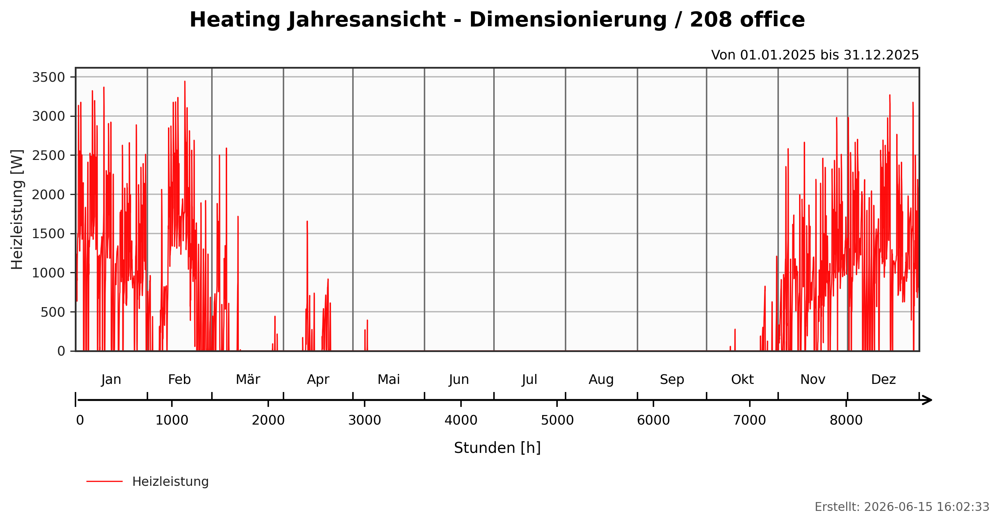

### `heating-overlay`

**Beispielbefehl:** `python -m ma_analyse plot-template --template heating-overlay --variants Dimensionierung --rooms "208 office"`

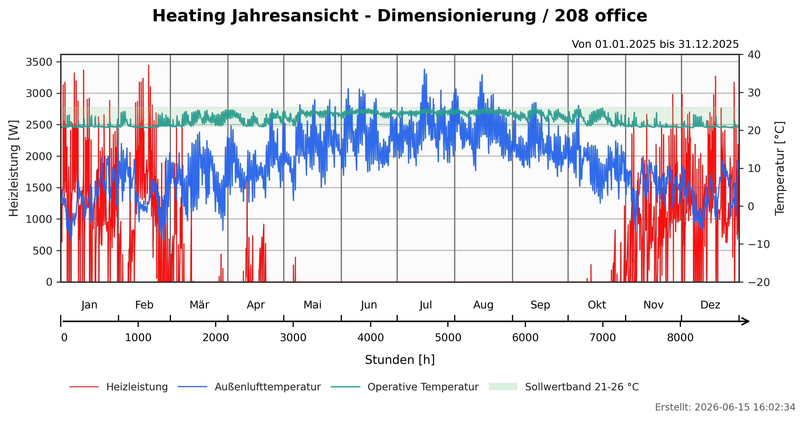

### `heating-month`

**Beispielbefehl:** `python -m ma_analyse plot-template --template heating-month --variants Dimensionierung --rooms "208 office" --month Jul`

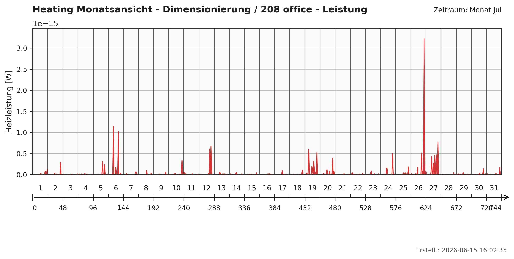

### `heating-week`

**Beispielbefehl:** `python -m ma_analyse plot-template --template heating-week --variants Dimensionierung --rooms "208 office" --week 29`

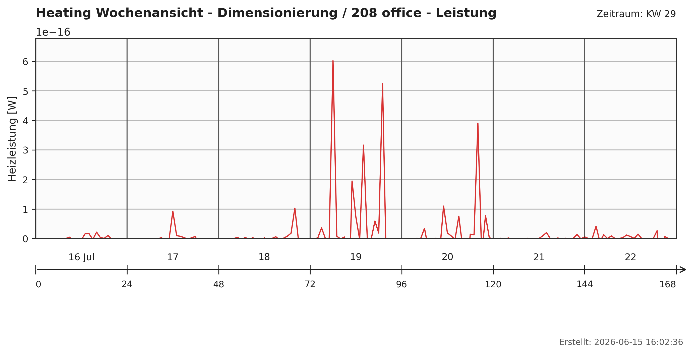

### `heating-day`

**Beispielbefehl:** `python -m ma_analyse plot-template --template heating-day --variants Dimensionierung --rooms "208 office" --month Jul --day 20`

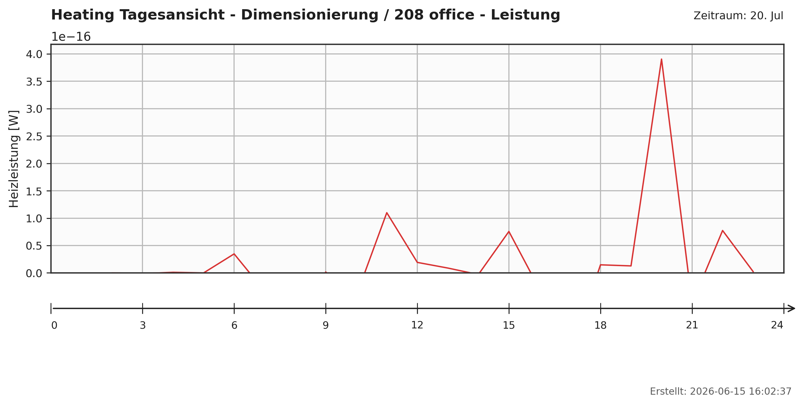

## Cooling

### `cooling-year`

**Beispielbefehl:** `python -m ma_analyse plot-template --template cooling-year --variants Dimensionierung --rooms "208 office"`

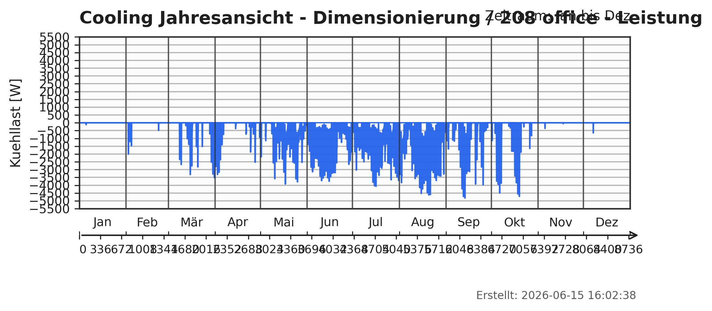

### `cooling-month`

**Beispielbefehl:** `python -m ma_analyse plot-template --template cooling-month --variants Dimensionierung --rooms "208 office" --month Jul`

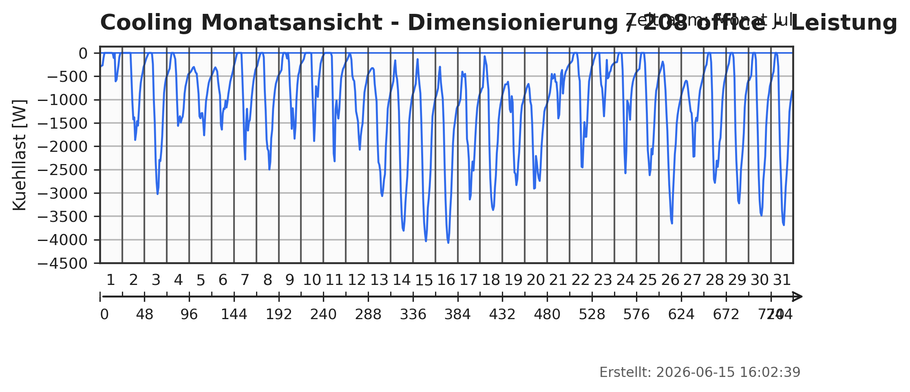

### `cooling-week`

**Beispielbefehl:** `python -m ma_analyse plot-template --template cooling-week --variants Dimensionierung --rooms "208 office" --week 29`

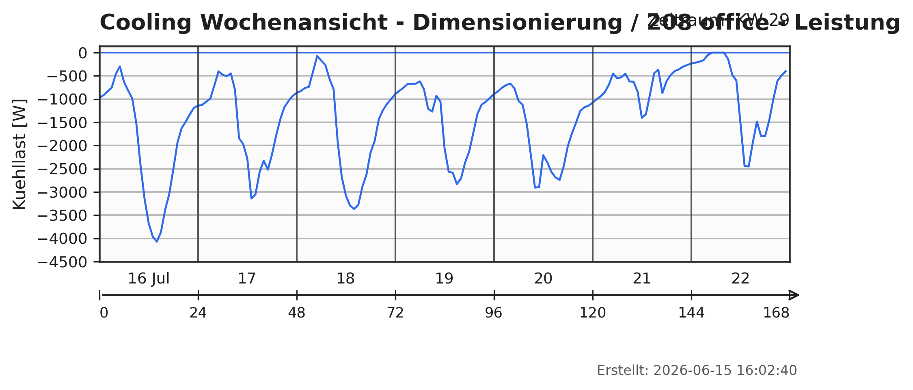

### `cooling-day`

**Beispielbefehl:** `python -m ma_analyse plot-template --template cooling-day --variants Dimensionierung --rooms "208 office" --month Jul --day 20`

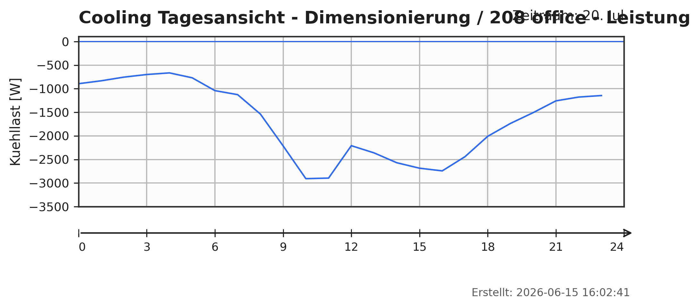

### `cooling-absolute-year`

**Beispielbefehl:** `python -m ma_analyse plot-template --template cooling-absolute-year --variants Dimensionierung --rooms "208 office"`

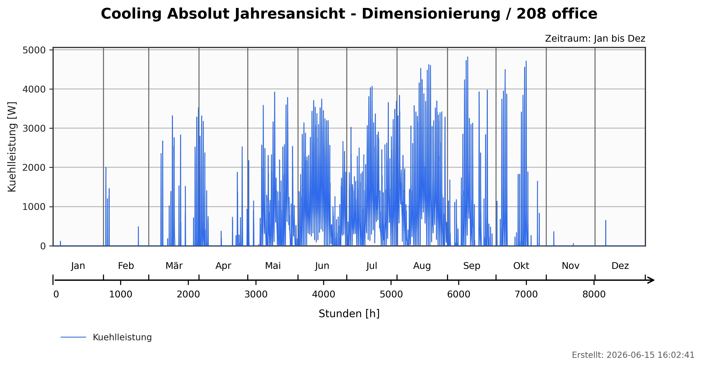

### `cooling-absolute-month`

**Beispielbefehl:** `python -m ma_analyse plot-template --template cooling-absolute-month --variants Dimensionierung --rooms "208 office" --month Jul`

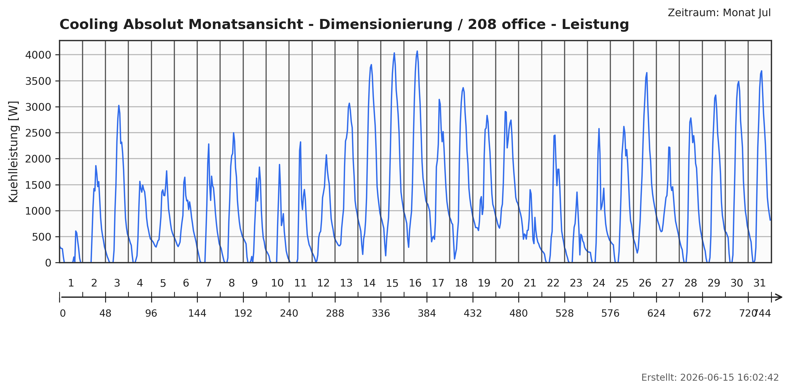

### `cooling-absolute-week`

**Beispielbefehl:** `python -m ma_analyse plot-template --template cooling-absolute-week --variants Dimensionierung --rooms "208 office" --week 29`

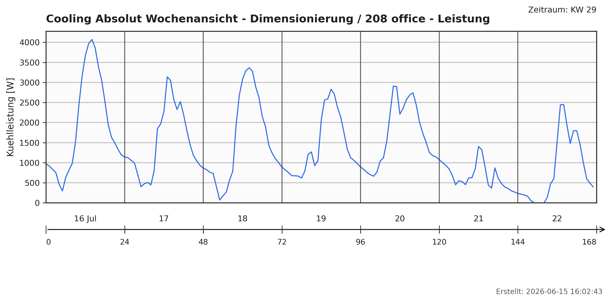

### `cooling-absolute-day`

**Beispielbefehl:** `python -m ma_analyse plot-template --template cooling-absolute-day --variants Dimensionierung --rooms "208 office" --month Jul --day 20`

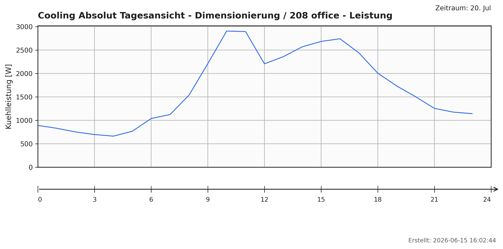

## Barplots

### `heating-bar`

**Beispielbefehl:** `python -m ma_analyse plot-template --template heating-bar --variants Dimensionierung --rooms "101 lobby,109 office,113 meeting,208 office,214 meeting"`

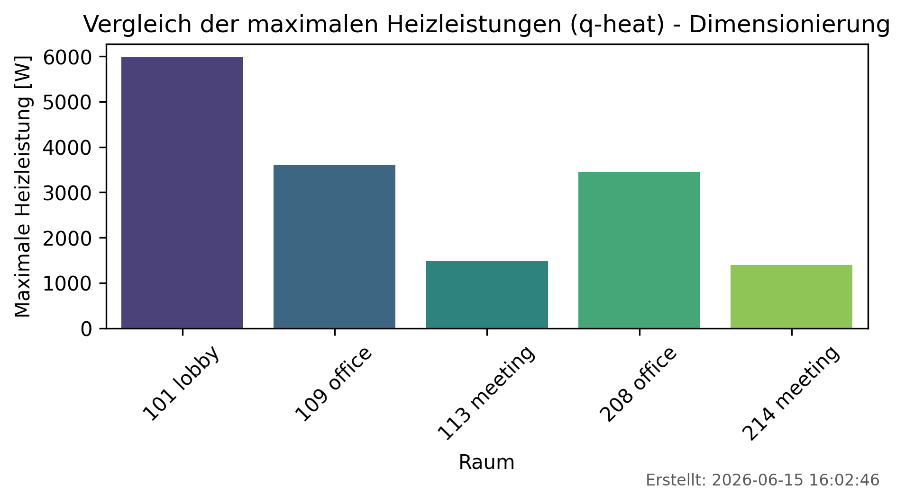

### `cooling-bar`

**Beispielbefehl:** `python -m ma_analyse plot-template --template cooling-bar --variants Dimensionierung --rooms "101 lobby,109 office,113 meeting,208 office,214 meeting"`

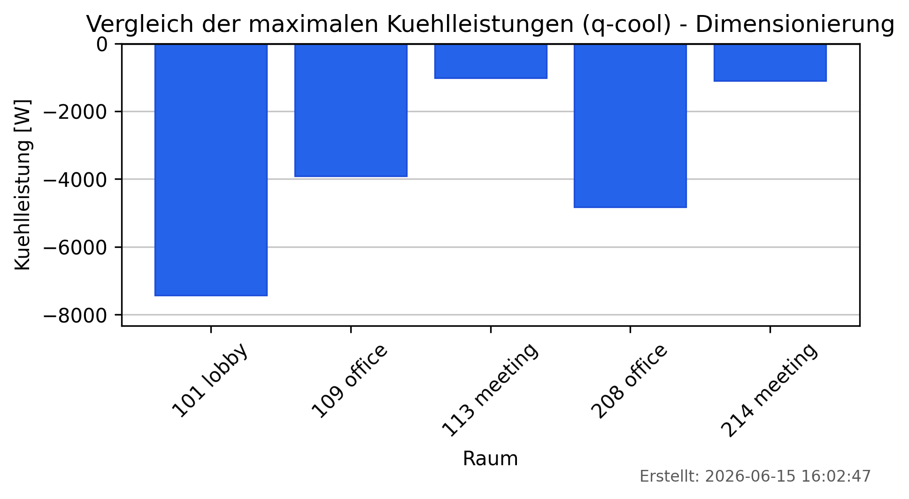

## Comfort

### `comfort-plot`

**Beispielbefehl:** `python -m ma_analyse plot-template --template comfort-plot --variants Dimensionierung --rooms "208 office"`

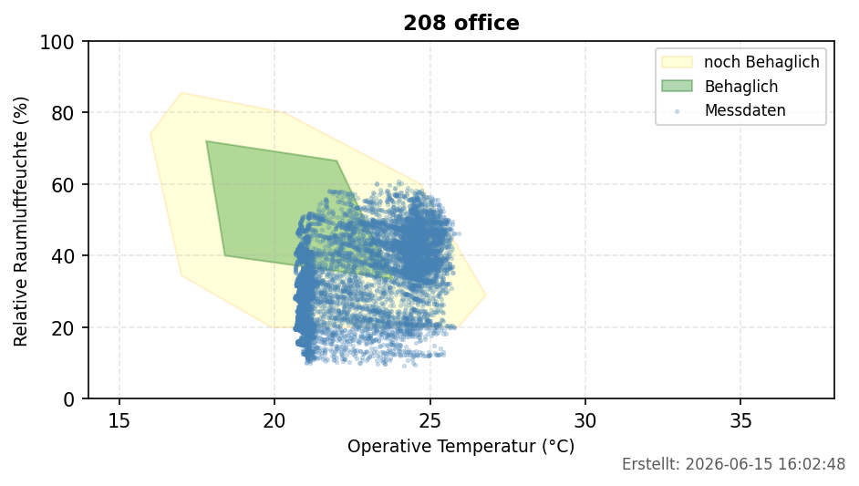

### `comfort-analysis`

**Beispielbefehl:** `python -m ma_analyse plot-template --template comfort-analysis --variants Dimensionierung --rooms "208 office"`

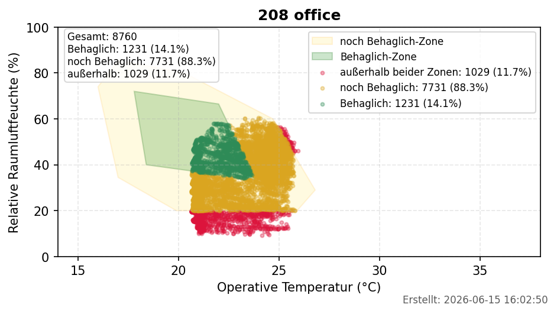

### `comfort-plot-overview`

**Beispielbefehl:** `python -m ma_analyse plot-template --template comfort-plot-overview --variants Dimensionierung --rooms "101 lobby,109 office,113 meeting,208 office,214 meeting"`

[PDF-Ausgabe](../examples/plot_template_analyse/comfort-plot-overview.pdf)

### `comfort-analysis-overview`

**Beispielbefehl:** `python -m ma_analyse plot-template --template comfort-analysis-overview --variants Dimensionierung --rooms "101 lobby,109 office,113 meeting,208 office,214 meeting"`

[PDF-Ausgabe](../examples/plot_template_analyse/comfort-analysis-overview.pdf)

## Energy Balance

### `energy-balance-year`

**Beispielbefehl:** `python -m ma_analyse plot-template --template energy-balance-year --variants Dimensionierung --rooms "208 office"`

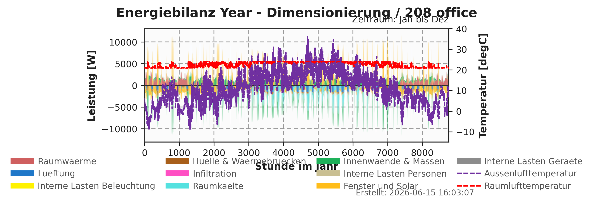

### `energy-balance-month`

**Beispielbefehl:** `python -m ma_analyse plot-template --template energy-balance-month --variants Dimensionierung --rooms "208 office" --month Jul`

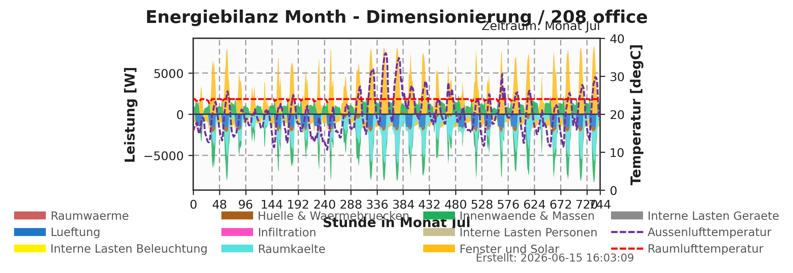

### `energy-balance-week`

**Beispielbefehl:** `python -m ma_analyse plot-template --template energy-balance-week --variants Dimensionierung --rooms "208 office" --week 29`

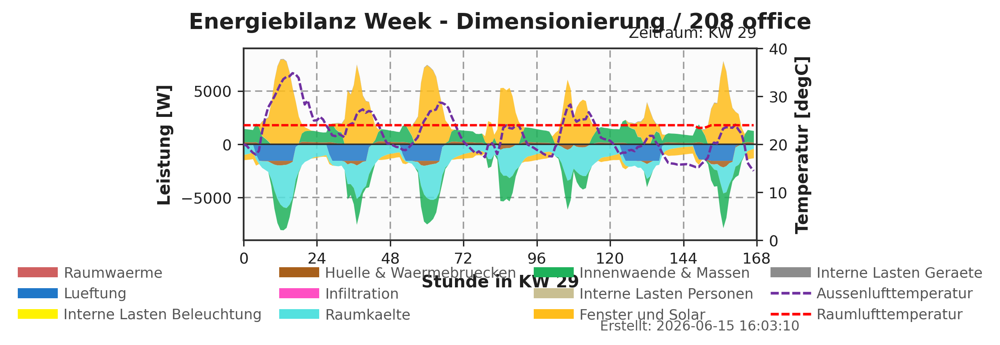

### `energy-balance-day`

**Beispielbefehl:** `python -m ma_analyse plot-template --template energy-balance-day --variants Dimensionierung --rooms "208 office" --month Jul --day 20`

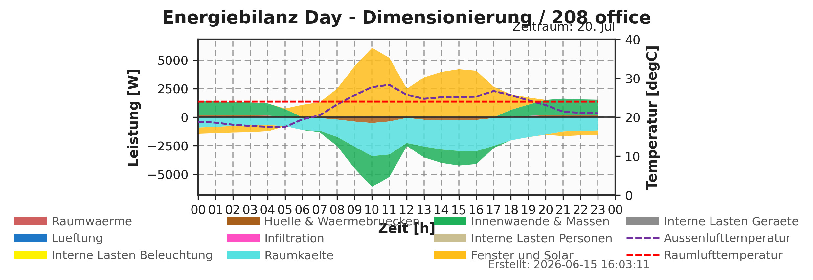

## Internal Loads

### `internal-loads-year`

**Beispielbefehl:** `python -m ma_analyse plot-template --template internal-loads-year --variants Dimensionierung --rooms "208 office"`

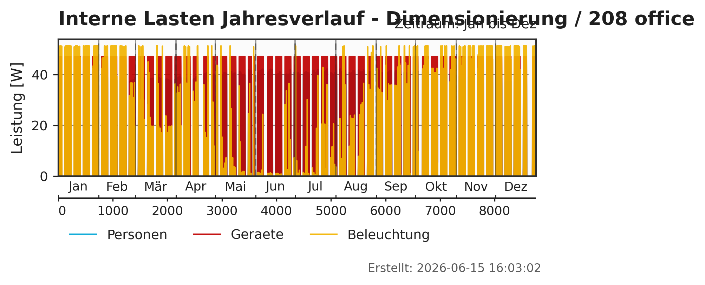

### `internal-loads-month`

**Beispielbefehl:** `python -m ma_analyse plot-template --template internal-loads-month --variants Dimensionierung --rooms "208 office" --month Jul`

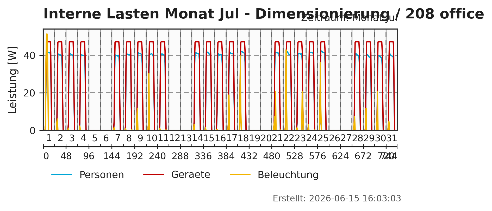

### `internal-loads-week`

**Beispielbefehl:** `python -m ma_analyse plot-template --template internal-loads-week --variants Dimensionierung --rooms "208 office" --week 29`

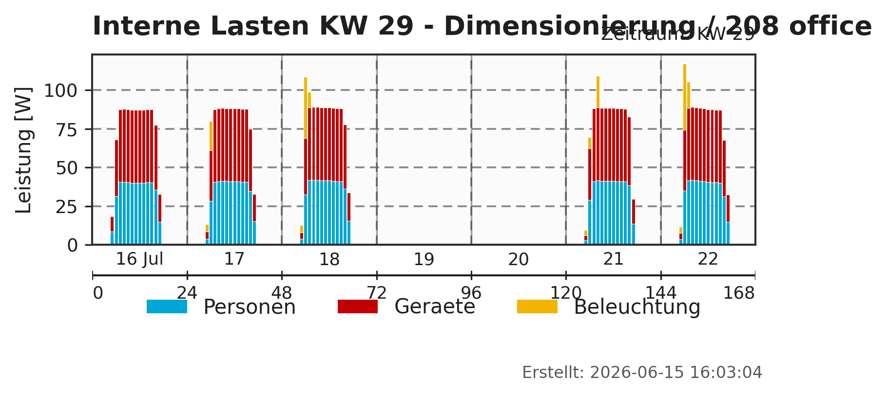

### `internal-loads-day`

**Beispielbefehl:** `python -m ma_analyse plot-template --template internal-loads-day --variants Dimensionierung --rooms "208 office" --month Jul --day 20`

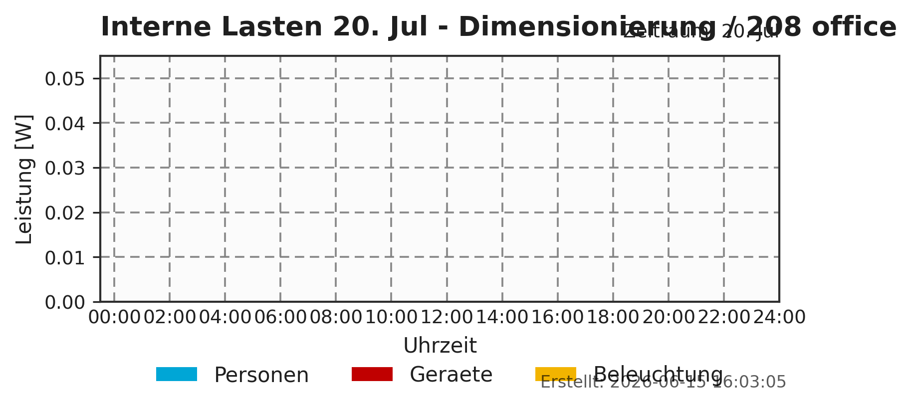

### `internal-loads-monthly-sum`

**Beispielbefehl:** `python -m ma_analyse plot-template --template internal-loads-monthly-sum --variants Dimensionierung --rooms "208 office"`

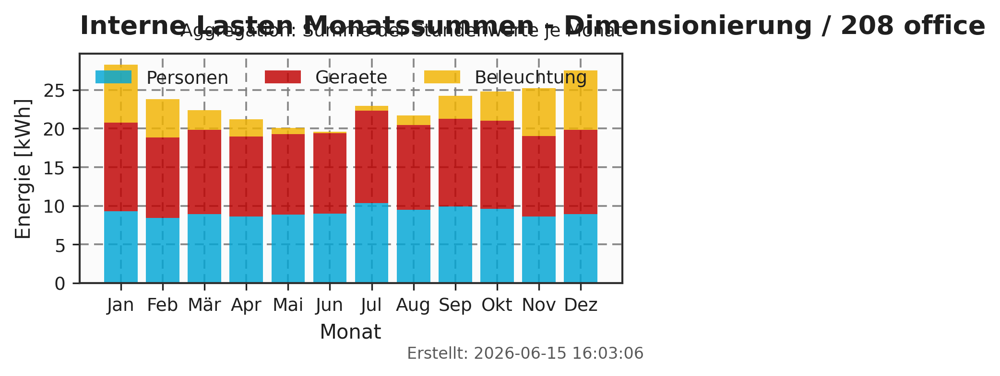

### `internal-loads-room-comparison`

**Beispielbefehl:** `python -m ma_analyse plot-template --template internal-loads-room-comparison --variants Dimensionierung --rooms "101 lobby,109 office,113 meeting,208 office,214 meeting"`

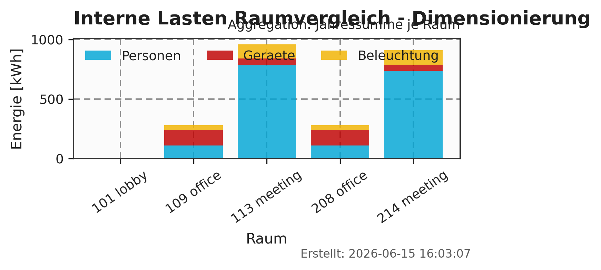

## Thermal Room Climate

### `thermal-room-climate-year`

**Beispielbefehl:** `python -m ma_analyse plot-template --template thermal-room-climate-year --variants Dimensionierung --rooms "208 office"`

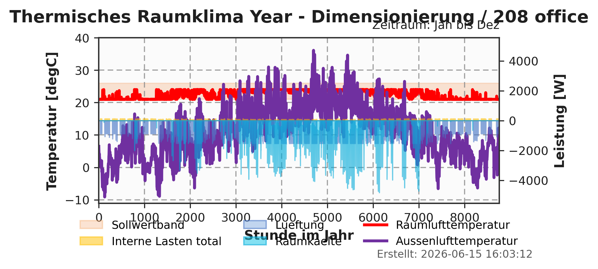

### `thermal-room-climate-month`

**Beispielbefehl:** `python -m ma_analyse plot-template --template thermal-room-climate-month --variants Dimensionierung --rooms "208 office" --month Jul`

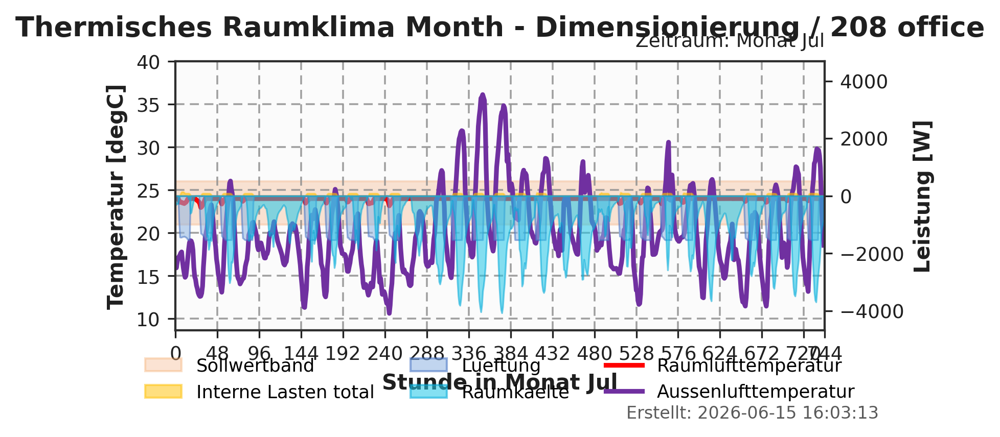

### `thermal-room-climate-week`

**Beispielbefehl:** `python -m ma_analyse plot-template --template thermal-room-climate-week --variants Dimensionierung --rooms "208 office" --week 29`

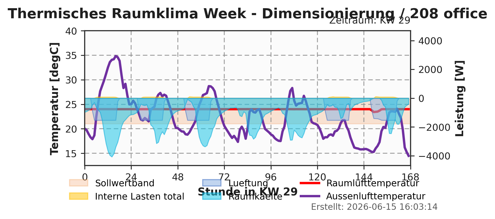

### `thermal-room-climate-day`

**Beispielbefehl:** `python -m ma_analyse plot-template --template thermal-room-climate-day --variants Dimensionierung --rooms "208 office" --month Jul --day 20`

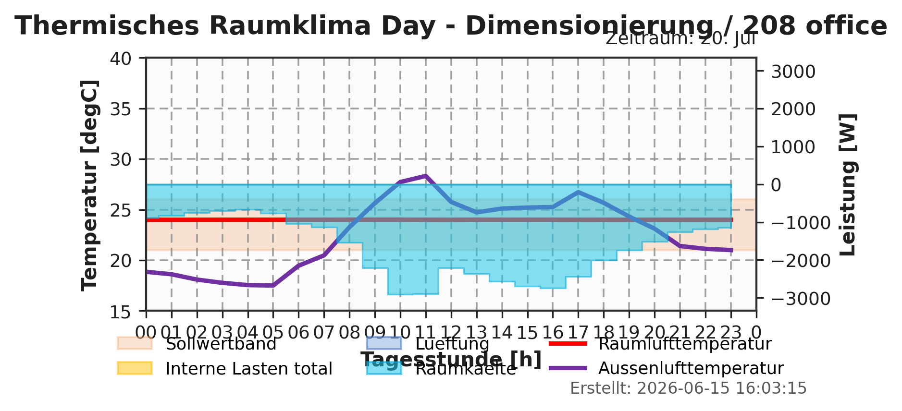

---

Diese Beispiele werden reproduzierbar mit dem Befehl `python -m ma_analyse plot-template-examples` erzeugt.
Wenn sich das Aussehen von Plot-Templates aendert, ersetzen neue Generierungsläufe die vorhandenen Dateien.
