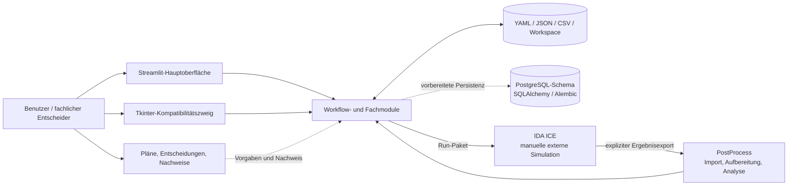
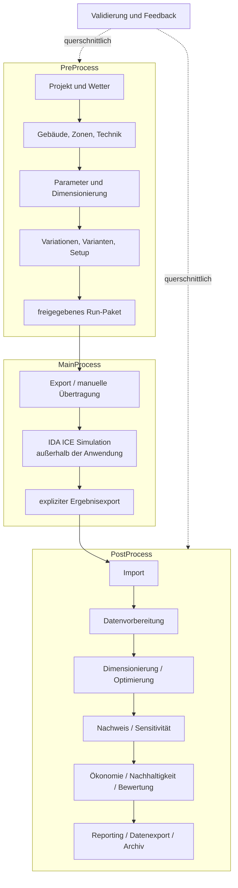
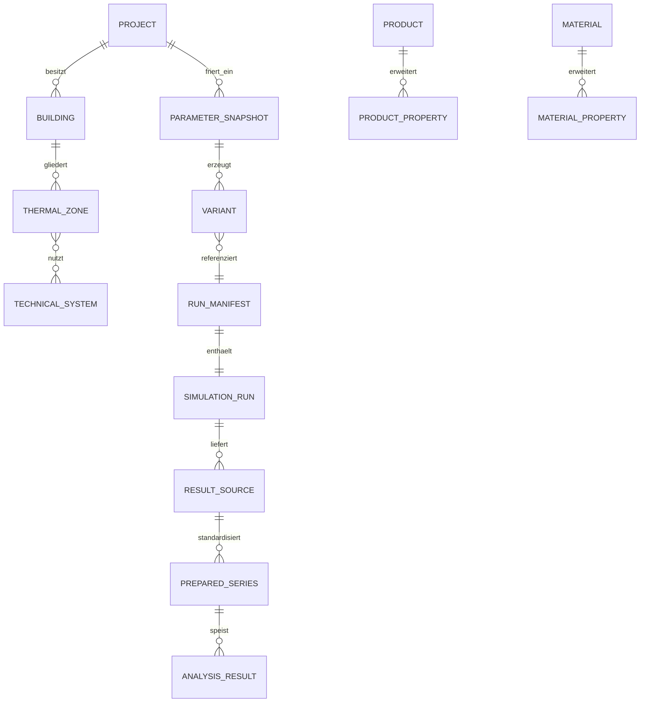
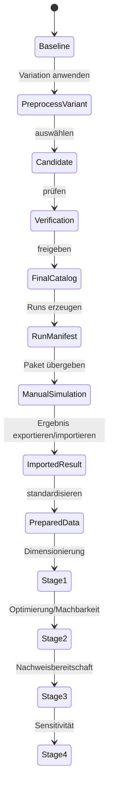
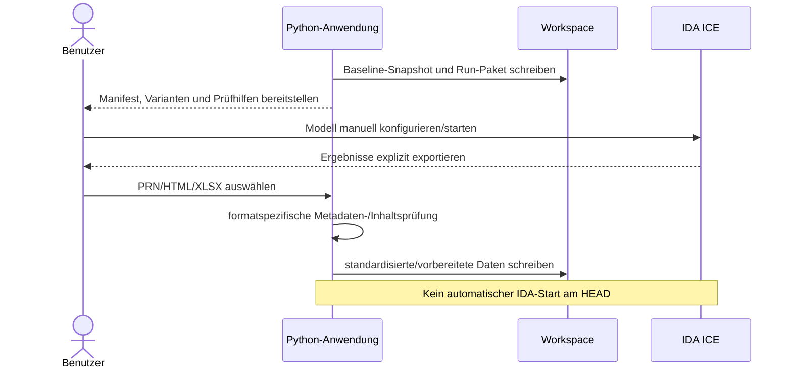
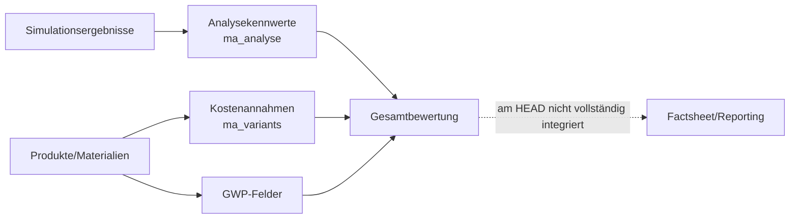
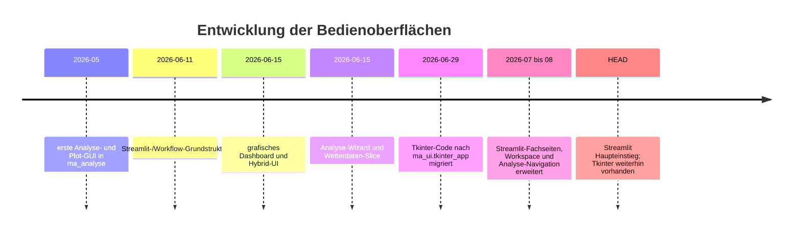
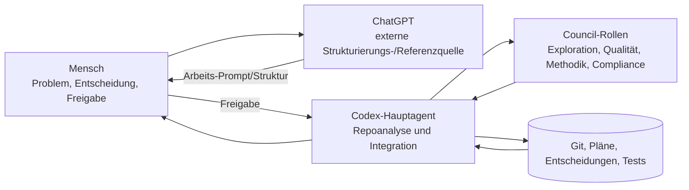
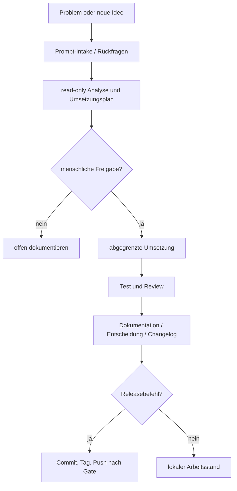

# Technische Bestandsaufnahme für Kapitel 5 der Masterarbeit

**Analyse- und Nachweisstand:** 22.08.2026<br>
**Untersuchter Branch:** `main`<br>
**Fixierter Commit:** `c6f7f5fd6c1f712a34e50f3d654525d73966a858`<br>
**Commitdatum:** 20.08.2026, 01:11:55 Uhr (UTC+02:00)<br>
**Commit-Message:** `Release 0.42.2 - Tagesend-Dokumentation`<br>
**Tag:** `v0.42.2`<br>
**Vorgänger:** `5562b5d`<br>
**Umfang der Historie:** 67 vom HEAD erreichbare Commits vom 24.05.2026 bis 20.08.2026

> Dieser Bericht ist eine datierte technische Momentaufnahme und keine neue
> Zielarchitektur. Er dient als vollständiges Übergabematerial für die spätere
> gemeinsame Priorisierung und Gliederung von Kapitel 5. Aussagen über den
> aktuellen Stand beziehen sich ausschließlich auf den oben fixierten Commit.

## 1. Auftrag, Abgrenzung und Leselogik

Untersucht wurden der aktuelle versionierte Quellcode, Konfigurationen, Tests,
Projekt- und Architekturdokumente sowie die vollständige Git-Historie. Die
Historie wurde zielgerichtet hinsichtlich der für Kapitel 5 relevanten
Entwicklungsentscheidungen, Architekturänderungen, Funktionsentwicklungen und
verworfenen Ansätze ausgewertet; nicht jeder Commit wurde gleich tief
analysiert. Nicht Gegenstand waren eine Weiterentwicklung der Software, eine
fachliche Freigabe geschützter Norminhalte, eine automatische IDA-ICE-Simulation
oder eine abschließende wissenschaftliche Bewertung der Arbeit.

Der Bericht unterscheidet vier Zeitebenen:

| Kennzeichnung | Bedeutung |
|---|---|
| **HEAD-IST** | Am fixierten Commit nachweisbar implementiert oder konfiguriert |
| **Teilweise** | Technischer Baustein vorhanden, aber fachlich oder prozessual nicht vollständig geschlossen |
| **Geplant** | In führenden Plänen oder Katalogen vorgesehen, am HEAD nicht vollständig implementiert |
| **Historisch/verworfen** | In früheren Commits vorhanden oder diskutiert, aber kein Bestandteil des aktuellen HEAD-Zustands |

Zusätzlich werden Bewertungen mit `umgesetzt`, `teilweise umgesetzt`,
`strukturell vorbereitet`, `geplant`, `manuell`, `nicht belegt` oder
`nicht evaluierbar` bezeichnet. Ein Dateiname oder Katalogeintrag allein gilt
nicht als Beleg einer vollständigen Funktion.

## 2. Methodik und Quellenhierarchie

### 2.1 Reproduzierbares Untersuchungsverfahren

1. Der Git-Snapshot wurde mit Branch, vollständigem Hash, Tag, Datum und
   Vorgänger fixiert.
2. Aktuelle Aussagen wurden aus Git-Objekten (`git show`, `git grep`,
   `git ls-tree`) bzw. aus gegenüber HEAD unveränderten Quell- und Testdateien
   gewonnen. Dadurch flossen vorhandene, nicht zum Auftrag gehörende lokale
   Dokumentänderungen nicht in den HEAD-Befund ein.
3. Die vollständige erreichbare Historie wurde chronologisch inventarisiert;
   Schlüsselcommits wurden anhand ihrer betroffenen Dateien und Diffs vertieft.
4. Architektur, Code, Tests, Pläne und Entscheidungen wurden gegeneinander
   abgeglichen. Widersprüche werden ausgewiesen und nicht stillschweigend
   aufgelöst.
5. Zulässige lokale Prüfungen wurden ohne persistente Änderung an Produktivcode,
   Konfiguration oder produktiven Daten ausgeführt. Temporäre pytest-Artefakte
   wurden von der Testumgebung verwaltet.

### 2.2 Rangfolge der Nachweise

| Rang | Quelle | Verwendungszweck |
|---:|---|---|
| 1 | Fixierter Git-Snapshot, Quellcode, Tests, Konfiguration | Aktueller technischer Bestand |
| 2 | Führende Gesamtpläne, Nutzerentscheidungen, ADRs | Zielbild, Freigaben und bewusste Abgrenzungen |
| 3 | Planstatus, Planindex, Modul-READMEs, Changelog | dokumentierter Arbeits- und Releasestand |
| 4 | Historische Commits und archivierte Dokumente | Entwicklungsweg und verworfene Zustände |
| 5 | Laufzeitkataloge und UI-Statusanzeigen | Bedien- und Workflowdarstellung; nicht automatisch Zielarchitektur |

### 2.3 Arbeitsbaum und Datenschutz

Vor Beginn bestanden lokale, nicht zum Auftrag gehörende Änderungen an
`CHANGELOG.md`, einem archivierten Chat-Handover und `PLAN_STATUS.md` sowie der
neue unabhängige Analyseplan. Sie wurden weder verändert noch als HEAD-Evidenz
verwendet. Historische Inhalte werden datensparsam über Hash, Datum, Message,
Bereich und sachliche Änderung beschrieben. Secrets, Zugangsdaten,
personenbezogene Inhalte, absolute Benutzerpfade und Inhalte externer
Arbeitsablagen werden nicht reproduziert.

Der externe semantische Navigator in der getrennten Arbeitsablage war nicht
Bestandteil des freigegebenen Repository-Scopes und in dieser Sitzung nicht
lesbar. Der Bericht ersetzt ihn nicht durch einen unkontrollierten Scan.

## 3. Kurzfazit für Kapitel 5

Das Repository belegt eine modular aufgebaute Python-Anwendung, die einen
dreiphasigen Gebäude- und Simulationsworkflow von PreProcess über den manuellen
IDA-ICE-MainProcess bis zum PostProcess strukturiert. Der aktuelle Haupteinstieg
ist Streamlit; der zuvor entwickelte Tkinter-Zweig wurde nicht gelöscht,
sondern als kompatible, fachlich weiterhin relevante Oberfläche nach
`ma_ui.tkinter_app` migriert. Fachlich weit entwickelt sind Projekt-, Gebäude-,
Zonen-, Technik-, Parameter-, Varianten-, Simulationsvorbereitungs-, Wetter-,
Datenvorbereitungs- und Analysebausteine. Wirtschaftlichkeit, Nachhaltigkeit,
Gesamtbewertung, Reporting und Datenexport sind demgegenüber überwiegend
strukturell vorbereitet, als Demo umgesetzt oder geplant.

Die stärksten Architekturmerkmale sind stabile Verträge, Snapshot- und
Fingerprint-Mechanismen, eine explizite Grenze zur manuellen Simulation,
umfangreiche automatisierte Tests und eine eng versionierte Entscheidungs- und
Planungsdokumentation. Grenzen bestehen bei der einheitlichen Persistenz, dem
vollständigen End-to-End-Nachweis mit realen Daten, produktiven Normregeln,
versionsgenau fixierten Abhängigkeiten, CI und integrierten
Energie-/Kosten-/Nachhaltigkeitsbewertungen.

Die Entwicklung lässt sich neutral als **iterativ-inkrementell, prototyp- und
testgestützt mit expliziten Freigabe-, Review- und Dokumentationsgates**
beschreiben. Eine formale Zuordnung zu Scrum, Design Science Research, Action
Research oder DevOps ist aus dem Repository allein nicht belegbar.

## 4. Repository- und Systemübersicht

### 4.1 Quantitativer Bestand

| Kennzahl | HEAD-Befund |
|---|---:|
| Python-Pakete unter `src/` | 25 |
| versionierte Dateien unter `src/` | 374 |
| Python-Dateien unter `tests/` einschließlich `conftest.py` | 95 |
| von pytest gesammelte Testfälle | 907 |
| erreichbare Git-Commits | 67 |
| Laufzeitabhängigkeiten in `pyproject.toml` | 11 |
| optionale Entwicklungsabhängigkeiten | 3 |
| projektlokale Agentenrollen | 5 |
| projektlokale Skills | 4 |

### 4.2 Systemkontext



Die Datenbankarchitektur ist technisch vorhanden, aber nicht der alleinige
aktive Speicherpfad der gesamten Anwendung. YAML-, JSON-, CSV- und externe
Workspace-Dateien bleiben wichtige Betriebs- und Austauschformate.

## 5. Aktuelle Modularchitektur

### 5.1 Paketinventar

| Paket | Dateien | Aktueller Zweck | Reife am HEAD |
|---|---:|---|---|
| `ma_analyse` | 71 | Analyse-Orchestrierung, Kennwerte, Diagramme und Exporte | umgesetzt, historisch gewachsener Kern |
| `ma_assessment` | 1 | Zielnamespace Gesamtbewertung | strukturell vorbereitet |
| `ma_building` | 12 | Gebäudemodell, Import, LoD-1 und thermische Bilanz | teilweise bis umgesetzt |
| `ma_core` | 4 | gemeinsame Kernmodelle/-hilfen | umgesetzt; Moduldokumentation fehlt |
| `ma_data_export` | 1 | Zielnamespace Datenexport | strukturell vorbereitet |
| `ma_data_preparation` | 7 | Standardisierung, Qualitätsprüfung und vorbereitete Zeitreihen | umgesetzt |
| `ma_database` | 2 | schreibgeschützter Demo-/Katalogzugriff | teilweise |
| `ma_dimensionierung` | 4 | öffentlicher Gateway und neue Dimensionierungsverträge | teilweise; Eigentümermigration offen |
| `ma_economy` | 1 | Zielnamespace Wirtschaftlichkeit | strukturell vorbereitet |
| `ma_export_simulation` | 3 | Adapter-/Exportgrenze zur Simulation | Adaptergerüst |
| `ma_feedback` | 1 | Zielnamespace Feedback | strukturell vorbereitet |
| `ma_import_simulation` | 5 | kontrollierter Ergebnisimport und Formatgate | umgesetzt für explizite Exporte |
| `ma_parameters` | 19 | Referenz-, Baseline-, Snapshot- und Variationsmodelle | umgesetzt |
| `ma_project` | 4 | Projektidentität, Standort und Untersuchungskontext | umgesetzt |
| `ma_reporting` | 1 | Zielnamespace Berichterstellung | strukturell vorbereitet |
| `ma_simulation_setup` | 4 | Setup-, Run- und Manifestverträge | umgesetzt/teilweise integriert |
| `ma_sustainability` | 1 | Zielnamespace Nachhaltigkeit | strukturell vorbereitet |
| `ma_technical` | 22 | technische Systeme, Übergaben und Revisionen | umgesetzt/teilweise integriert |
| `ma_ui` | 98 | Streamlit- und Tkinter-Oberflächen | umgesetzt, hybrid |
| `ma_validation` | 3 | generische Diagnostik, Release- und Validierungsmodelle | umgesetzt als Querschnittsbaustein |
| `ma_variants` | 70 | Varianten, Kataloge, DB-Modelle, Studien und Demoökonomie | umfangreich, heterogen |
| `ma_weather` | 17 | Wetterimport, Geodaten, Prüfung, Kennwerte und Diagramme | umgesetzt/teilweise |
| `ma_workflow` | 13 | Phasen-, Schritt-, Status- und Übergabekatalog | umgesetzt; Status teils nachlaufend |
| `ma_workspace` | 2 | Projekt-Workspace außerhalb des Repositorys | umgesetzt, externe Ablage erforderlich |
| `ma_zones` | 8 | thermische Zonen und Nutzungsprofile | umgesetzt/teilweise integriert |

### 5.2 Architekturbeobachtungen

- Die physische Paketstruktur folgt überwiegend fachlichen Domänen. Ältere
  Funktionen verbleiben bewusst in `ma_analyse` und `ma_variants`, während
  neue Zielnamespaces bereits existieren. Das ist ein nachvollziehbarer
  Migrationszustand, keine vollständig bereinigte Zielarchitektur.
- `ma_dimensionierung` stellt einen öffentlichen Gateway bereit, die
  historische Implementierung liegt teilweise weiterhin in `ma_analyse`.
- Ökonomische Berechnungen und einfache Variantenreports existieren unter
  `ma_variants`, obwohl `ma_economy` und `ma_reporting` noch leer sind.
- Der Workflowkatalog enthält teilweise ältere Statuswerte. Ein Status
  `planned` beweist daher nicht, dass keinerlei Code existiert.
- Ein zentraler `SimulationCase` gehört ausdrücklich nicht zu den aktuellen
  Run-/Variant-Verträgen. Die Identitäten werden über Variant-, Run- und
  Manifestreferenzen getrennt gehalten.

## 6. Prozessarchitektur und Funktionszuordnung

### 6.1 Gesamtprozess



### 6.2 Prozess-Funktions-Matrix

| Prozessschritt | Hauptpakete | Konkreter HEAD-Bestand | Status |
|---|---|---|---|
| Projekt | `ma_project`, `ma_workspace` | Identität, Standort, Untersuchungsrahmen, externer Workspace | umgesetzt |
| Wetter | `ma_weather`, `ma_ui` | Katalog, Import, Geodaten, Prüfung, Kennwerte, Galerie | teilweise bis umgesetzt |
| Gebäude | `ma_building` | Gebäudemodell, LoD-1, Flächen und thermische Bilanz | teilweise bis umgesetzt |
| Zonen | `ma_zones` | Zonen, Nutzungsprofile, Technikzuordnung | teilweise |
| Technik | `ma_technical` | Referenzsysteme, Spezifikation, Übergaben, Revision | teilweise bis umgesetzt |
| Parameter | `ma_parameters` | Quellen, Baseline, Snapshots, Regeln, Variation | umgesetzt |
| Dimensionierung | `ma_dimensionierung`, `ma_analyse` | transparente LoD-1-Heiz-/Kühllast und Verträge | teilweise; nicht normativ |
| Varianten | `ma_variants` | Preprocess-, Auswahl-, Final- und Studienmodelle | umfangreich umgesetzt |
| Simulation Setup | `ma_simulation_setup` | Setup, Runs, Manifeste, Baselinebindung | umgesetzt/Caller-Migration offen |
| Export Simulation | `ma_export_simulation` | neutrale Adaptergrenze und Run-Pakete | teilweise/manuell |
| IDA ICE | extern | kein automatischer Simulationsstart | manuell |
| Import Simulation | `ma_import_simulation` | `.prn`, `.html`, `.xlsx`; blockiert native Modellformate | umgesetzt mit Grenzen |
| Datenvorbereitung | `ma_data_preparation` | Provenienz, Standardisierung, Qualitätsdiagnostik, vorbereitete Serien | umgesetzt |
| Analyse Stufe 1 | `ma_analyse` | Dimensionierungskennwerte | umgesetzt/teilweise |
| Analyse Stufe 2 | `ma_analyse` | Ziele, Metriken, Constraints, Machbarkeit | umgesetzt/teilweise |
| Analyse Stufe 3 | `ma_analyse` | Readiness, Profile und Ergebnisverträge | strukturell umgesetzt; fachlich nicht evaluierbar |
| Analyse Stufe 4 | `ma_analyse`, UI | Varianten-/Zeitfensterbausteine | teilweise; keine integrierte Sensitivitätsbewertung |
| Wirtschaftlichkeit | `ma_variants`, `ma_economy` | einfache generische Kostenrechnung und Annahmen | Demo/teilweise |
| Nachhaltigkeit | `ma_sustainability`, Produktkatalog | GWP-Felder vorhanden | strukturell vorbereitet |
| Gesamtbewertung | `ma_assessment` | UI zeigt derzeit primär ökonomische Annahmen | geplant/strukturell |
| Reporting/Datenexport | `ma_variants`, `ma_reporting`, `ma_data_export` | JSON-/CSV-Export, Analyseplots, Excel; kein vollständiges Factsheet | teilweise |
| Dokumentation/Archiv | Projekt-Docs, Workspace | versionierte Nachweise und externe Arbeitsablage | teilweise/manuell |

## 7. Daten- und Domänenmodell

### 7.1 Zentrale Datenobjekte

| Domäne | Repräsentative Modelle | Aufgabe |
|---|---|---|
| Projekt | `ProjectIdentity`, `ProjectLocation`, `Investigation`, `ProjectContext` | stabile Projekt- und Untersuchungsidentität |
| Gebäude | `BuildingInfo`, `Storey`, `Space`, `PhysicalElement`, `Opening`, `BuildingModelSpecification` | bauliche Struktur und Annahmen |
| Zonen | `UsageProfile`, `ThermalZone`, `ZoneModelSpecification` | thermische Zonierung und Nutzung |
| Technik | `ReferenceTechnicalSystem`, `TechnicalSystemSpecification` | Anlagenreferenz und Auswahl |
| Parameter | `ParameterValue`, `ReferenceVersion`, `BaselineParameterSnapshot`, `ParameterInputPackage` | versionierte Eingaben und Baseline |
| Variation | `VariationArea`, `VariationOption`, `VariationDimension`, `VariationSpecification` | kontrollierter Variantenraum |
| Varianten | `PreprocessVariant`, `CandidateVariant`, `VerificationVariant`, `FinalVariantCatalog` | Variantenlebenszyklus |
| Studie | `OptimizationCase`, `SensitivityCase` | Analysefälle für Optimierung/Sensitivität |
| Simulation | `SimulationSetupSpecification`, `SimulationRunV1`, `RunManifestV1` | explizite Übergabe an Simulation |
| Datenvorbereitung | `SourceProvenance`, `StandardizedSeries`, `TimeAxisDiagnostics`, `PreparedSeries` | nachvollziehbare Ergebnisaufbereitung |
| Analyse | `AnalysisConfig`, `Metric`, `Objective`, `Constraint`, `FeasibilityCheck` | Kennwerte und Entscheidungsregeln |
| Validierung | `DiagnosticMessage`, `ValidationResult`, `ReleaseDecision` | Diagnose und Freigabestatus |

### 7.2 Vereinfachtes Entity-Relationship-Bild



Das Diagramm zeigt die implementierten Hauptverträge in konzeptionell
vereinfachter Form; es ist kein vollständiges relationales Schema. Das
Produktmodell ist hybrid: Kernfelder wie Nennleistung, Preis und GWP
stehen in einer breiten Basistabelle; zusätzliche Eigenschaften werden über
generische Schlüssel-Wert-Tabellen ergänzt. Getrennte, über eine einheitliche
Produkt-ID vollständig integrierte Energie-, Ökonomie- und
Nachhaltigkeitstabellen sind nicht umgesetzt. Eine belastbare direkte
Produkt-zu-Varianten-Relation ist im aktuellen DB-Modell nur teilweise bzw.
indirekt vorhanden.

### 7.3 Persistenz und Provenienz

| Speicher-/Austauschform | Nutzung | Bewertung |
|---|---|---|
| YAML | Konfiguration, Referenzen, Demo- und Katalogdaten | aktiv, gut lesbar |
| JSON | Manifeste, Varianten- und Reportexport | aktiv |
| CSV | Tabellen, standardisierte/vorbereitete Daten | aktiv |
| Excel | explizite Simulationsergebnisse und Berichtsexporte | aktiv, manuelle Metadatenrisiken |
| PostgreSQL | SQLAlchemy-Modelle für Varianten/Kataloge/Ökonomie | technisch vorbereitet, nicht zentraler Gesamtpfad |
| Alembic | Schema-Migrationen | vorhanden |
| externer Workspace | reale Projekt- und Ergebnisdaten | vorgesehen, nicht Teil dieses Git-Snapshots |
| Parquet/VectorDB/RAG | kein belastbarer Projektbestand | nicht umgesetzt |

Provenienz ist über Quellen-IDs, SHA-256-Hashes, Content-Fingerprints,
Referenzversionen, Parameter-Snapshots, Run-Manifeste und vorbereitete
Datenpakete an vielen Übergängen vorhanden. Sie ist jedoch noch kein
einheitlicher, paketübergreifender Provenienzstandard. Besonders Produktdaten
und fachliche Bewertungsresultate sind nicht in derselben Konsequenz
eingefroren wie Parameterbaseline und Run-Paket.

## 8. Analyse-, Bewertungs- und Simulationslogik

### 8.1 Stufenmodell



Die Stufen sind nicht durchgehend als ein einziger automatischer Automat
orchestriert. Insbesondere Stage 3 enthält zwar prüfbare Verträge, aber keine
produktiven, fachlich freigegebenen Normformeln und Grenzwerte. Der korrekte
HEAD-Status ist deshalb `NOT_EVALUABLE`, nicht `PASS` oder `FAIL`. Stage 4
besitzt Auswahl- und Darstellungsbausteine, jedoch keine vollständig
integrierte Sensitivitätsbewertung.

### 8.2 Grenze zur Simulation



Native IDA-/EQUA-Modelldateien werden vom Ergebnisadapter bewusst nicht als
Auswertungsquelle akzeptiert. Das Formatgate reduziert Fehlverarbeitung, ist
aber kein Rechte- oder Lizenznachweis. Nur der PRN-Pfad ist an die
Zeitreihenstandardisierung und Qualitätsdiagnostik in `ma_data_preparation`
angebunden. HTML wird als Bericht mit Meta-Tags/Tabellen gelesen; XLSX liefert
in diesem Adapter Arbeitsmappenmetadaten. Eine einheitliche fachliche
Standardisierung aller drei Formate ist nicht implementiert.

### 8.3 Energie, Ökonomie und Nachhaltigkeit



Energiekennwerte, einfache Kostenrechnungen und GWP-Felder existieren, aber
der gemeinsame Datenfluss in eine reproduzierbare Gesamtbewertung und ein
vollständiges Factsheet ist nicht implementiert. Rangfolge, Gewichtung,
Pareto-Logik oder ein einheitliches Scoring dürfen daher nicht als aktueller
Funktionsbestand dargestellt werden.

## 9. Benutzeroberflächen und Bedienlogik

### 9.1 Aktueller Zustand

`src/ma_ui/streamlit_app/app.py` ist der zentrale grafische Haupteinstieg.
Daneben bestehen eine Kommandozeile (`ma-analyse`) und ein Tkinter-Zweig unter
`ma_ui.tkinter_app`. Die Entwicklung ist deshalb keine vollständige Ablösung
„Tkinter durch Streamlit“, sondern eine kontrollierte Migration mit erhaltener
Kompatibilitäts- und Referenzoberfläche.

Direkte Streamlit-Renderer bestehen für Start, Workspace, Projekt, Workflow,
Gebäude, Zonen, Technik, Parameter, Parametervariation, Dimensionierung,
Wetter, Varianten, Simulation Setup, Analyse und Assessment. Nicht direkt
gerenderte Katalogseiten zeigen generische Modul- bzw. Workflowinformationen.
Der Katalog enthält den Schlüssel `documentation` doppelt und weist für einige
bereits implementierte Pakete noch `planned` aus; dies ist eine dokumentierte
Statusdivergenz, kein Beleg fehlenden Codes.

Relevante UI-Unterbereiche sind unter anderem:

- Gebäude: Import, Übersicht, Räume, U-Werte, Ergebnisse und Bauteile;
- Wetter: Analyse, Diagramme und Verwaltung einschließlich Import, Scan und
  Prüfung;
- Analyse: Auswahl & Lauf, Dimensionierung, Optimierung, Nachweis und
  Sensitivität;
- Assessment: Systemkosten, Energiepreise und Szenarien; derzeit primär
  Annahmenpflege, keine integrierte Gesamtbewertung.

### 9.2 Historischer UI-Weg



### 9.3 Screenshot- und Abbildungsplan für Kapitel 5

| Nr. | Ansicht | Aussagezweck | Empfohlener Zustand |
|---:|---|---|---|
| 1 | Start-/Workflow-Dashboard | dreiphasiger Gesamtprozess | leeres Demo-Projekt |
| 2 | Projekt und Workspace | Projektidentität und externe Ablage | synthetische Daten |
| 3 | Gebäudeübersicht/LoD-1 | Gebäudemodell und transparente Annahmen | Small-Office-Demo |
| 4 | Zonen/Nutzungsprofile | fachliche Zonierung | synthetische Zonen |
| 5 | Technikauswahl | Referenzsystem und Übergabe | Demo-Katalog |
| 6 | Parameterbaseline | Quellen, Werte und Snapshot | freigegebener Demo-Snapshot |
| 7 | Parametervariationen | Variantenraum | begrenztes Beispiel |
| 8 | Varianten-/Run-Auswahl | Lebenszyklus und Run-Bezug | 2–3 Varianten |
| 9 | Simulation Setup | Manifest und manuelle Grenze | neutraler Run |
| 10 | Wetterprüfung/Galerie | Import, Qualitätsstatus und Diagramm | lizenzgeprüfte Demoquelle |
| 11 | Datenvorbereitung | Provenienz und Qualitätsdiagnostik | synthetischer Export |
| 12 | Analyse Stufe 1/2 | Dimensionierung, Kennwert und Machbarkeit | reproduzierbarer Testfall |
| 13 | Nachweis | `NOT_EVALUABLE` statt Scheingenauigkeit | fehlendes produktives Profil sichtbar |
| 14 | Sensitivität | vorhandene Auswahl-/Zeitfensterbausteine | als Teilfunktion kennzeichnen |
| 15 | Tkinter-Referenzansicht | historischer Entwicklungsweg | klar als Neben-/Altzweig beschriften |

Bei jeder Abbildung sollten Commit, Beispieldaten, Eingabeeinheiten und
Freigabestatus in der Bildunterschrift stehen. Reale oder geschützte Daten sind
zu vermeiden.

## 10. Konfiguration, Abhängigkeiten und Betriebsumgebung

### 10.1 Python-Paket und Einstiegspunkte

| Merkmal | HEAD-Wert |
|---|---|
| Paketname / Version | `ma-analyse` / `0.42.2` |
| Python | `>=3.14` |
| Haupt-CLI | `ma-analyse = ma_analyse.app.cli:main` |
| Wetter-CLI | `plot-template-weather = ma_weather.run_weather_analysis:main_plot_template_weather` |
| Streamlit | direkter App-Einstieg unter `ma_ui.streamlit_app` |
| Linter/Formatter | Ruff, Zeilenlänge 120, Ziel `py314` |
| Tests | pytest, Testpfad `tests`, Cache deaktiviert |

### 10.2 Bibliotheksinventar

| Bibliothek | Zweck im Projekt | Deklaration | lokal geprüfte Version |
|---|---|---|---:|
| Alembic | Datenbankschemamigration | Runtime | 1.18.4 |
| Matplotlib | Diagramme und Exporte | Runtime | 3.10.8 |
| openpyxl | Excel-Ein-/Ausgabe | Runtime | 3.1.5 |
| pandas | Tabellen und Zeitreihen | Runtime | 3.0.1 |
| pyproj | Koordinaten-/Geodatenumrechnung | Runtime | 3.7.2 |
| psycopg[binary] | PostgreSQL-Treiber | Runtime | 3.3.4 |
| PyYAML | YAML-Konfigurationen und Kataloge | Runtime | 6.0.3 |
| seaborn | statistische Visualisierung | Runtime | 0.13.2 |
| Shapely | Geometrieverarbeitung | Runtime | 2.1.2 |
| SQLAlchemy | ORM und DB-Modelle | Runtime | 2.0.50 |
| Streamlit | zentrale Weboberfläche | Runtime | 1.58.0 |
| pre-commit | lokale Qualitätsgates | Development | 4.6.0 |
| pytest | automatisierte Tests | Development | 9.0.3 |
| Ruff | Linting und Formatprüfung | Development | 0.15.14 |

Alle Abhängigkeiten sind ohne exakte Versionsgrenzen deklariert. Ein Lockfile,
Container-Image oder Conda-Environment ist nicht versioniert. Zudem enthält
`requirements.txt` weniger Pakete als `pyproject.toml` und lässt insbesondere
`pyproj` und `shapely` aus. Die untersuchte lokale `.venv` war lauffähig, ihre
editierbare Paketmetadaten-Version lautete jedoch noch `0.20.0` und wich damit
von HEAD `0.42.2` ab. Dieser lokale Drift beeinflusste den Quellcode nicht,
zeigt aber eine Reproduzierbarkeitsgrenze.

Die Versionsspalte beschreibt nur die lokale Prüfumgebung, nicht eine durch
das Repository garantierte Umgebung. Eine vollständige, rechtlich geprüfte
Third-Party-Lizenz- und NOTICE-Liste ist am HEAD nicht vorhanden; deshalb
werden hier keine unbestätigten Lizenzzuordnungen ergänzt.

### 10.3 Konfigurations- und Datenhaltung

Unter `config/` liegen überwiegend YAML-Dateien sowie Dokumentation und eine
Beispiel-`.env`; konkrete Geheimnisse werden nicht versioniert. Die
Datenbankkonfiguration erwartet entweder eine vollständige
`MA_VARIANTS_DATABASE_URL` oder einzelne PostgreSQL-Umgebungsvariablen. Die
Alembic-URL bleibt leer und wird zur Laufzeit bezogen. Streamlit deaktiviert
die automatische Sidebar-Navigation zugunsten der projektspezifischen
Navigation.

Es gibt keine versionierten GitHub-Actions-Workflows. Lokale Commit-Hooks und
Pre-Commit-Konfigurationen existieren, werden gemäß Projektgovernance jedoch
nicht als zwingende Project-OS-Abhängigkeit vorausgesetzt.

## 11. Test- und Qualitätsbestand

### 11.1 Ausgeführte Prüfungen am 22.08.2026

| Prüfung | Umgebung | Ergebnis | Interpretation |
|---|---|---:|---|
| pytest Collection | `.venv`, Python 3.14.0, pytest 9.0.3 | 907 gesammelt | vollständiger aktueller Testkatalog ladbar |
| fokussierter Architektur-/Workflowlauf | gleiche Umgebung | 209 bestanden, 1 fehlgeschlagen | Fehler ausschließlich fehlende `ma_core`-Moduldokumentation |
| vollständige pytest-Suite | gleiche Umgebung | **906 bestanden, 1 fehlgeschlagen**, 246,84 s | umfangreiche lokale Testsammlung; formal nicht vollständig grün |
| unabhängiger Methodik-Fokuslauf | gleiche Umgebung | 85 bestanden, 165,00 s | Zeitgewichtung, Aggregation, Wetter und Agentverträge grün |
| `ruff check src tests --no-cache` | Ruff 0.15.14 | alle Prüfungen bestanden | keine Lint-Befunde |
| `ruff format --check src tests --no-cache` | Ruff 0.15.14 | 131 Dateien würden formatiert; 330 bereits formatiert | Formatdrift, keine automatische Änderung vorgenommen |

Der fehlgeschlagene Test lautet
`test_every_module_has_complete_module_documentation` in
`tests/test_target_module_structure.py`; für `ma_core` fehlt die geforderte
Moduldokumentation. Das ist ein Dokumentations-/Architekturguardrail und kein
Hinweis auf einen fehlgeschlagenen numerischen Algorithmus. Gleichwohl ist die
Suite am fixierten HEAD formal nicht vollständig grün.

### 11.2 Testarten und Abdeckung

| Prüfbereich | Repräsentative Abdeckung | Grenze |
|---|---|---|
| Domänenmodelle | IDs, Validierung, Serialisierung, Snapshots | reale Projektvielfalt nicht vollständig abgebildet |
| Architekturverträge | Paketstruktur, Gateways, Agent-System | ein Dokumentationsguardrail rot |
| Workflow/Übergaben | Phasen, Kataloge, Run-/Variant-Verträge | Statuskatalog teils nachlaufend |
| Wetter | Import, Validierung, Kennwerte, Geodaten, Plots | reale Wetterquellen nicht mitversioniert |
| Gebäude/Zonen/Technik | Modelle, LoD-1, Bilanz, Übergabe | noch keine vollständige produktive Kette aller Detailmodelle |
| Parameter/Varianten | Baseline, Fingerprints, Variation, Auswahl | Produktbezug/Persistenz nicht vollständig geschlossen |
| Simulation Setup/Import | Manifest, Formatgate, Metadaten | keine automatische IDA-Ausführung |
| Datenvorbereitung | Zeitachse, Provenienz, Qualitätsdiagnostik | reale IDA-Semantik teilweise offen |
| Analyse | Stufenmodelle, zeitgewichtete Kennwerte, Machbarkeit | Stage 3/4 fachlich unvollständig |
| UI | Renderer-, Auswahl- und Zustandslogik mit Monkeypatches | kein Browser-E2E, kein `streamlit.testing.AppTest` |
| Tkinter | Auswahl-, Import- und Zustandslogik | kein vollständiger interaktiver GUI-E2E-Test |
| Diagramme | Smoke-Tests und Dateierzeugung | keine umfassende visuelle Qualitätsprüfung |

Die 94 `test_*.py`-Module liegen flach im Ordner `tests/`. Unit-, Contract-,
Integrations-, Regressions- und UI-nahe Tests sind anhand ihrer Namen und
Inhalte erkennbar, aber nicht in getrennten Verzeichnissen klassifiziert.
Temporäre Testordner werden über `tests/conftest.py` verwaltet. Die Prüfungen
erzeugten keine neuen versionierten Änderungen.

Reproduktionsbefehle (PowerShell, Repository-Wurzel):

```text
.venv\Scripts\python.exe -m pytest --collect-only -q
.venv\Scripts\python.exe -m pytest -q
.venv\Scripts\python.exe -m ruff check src tests --no-cache
.venv\Scripts\python.exe -m ruff format --check src tests --no-cache
```

Der vollständige Lauf meldete keine übersprungenen Tests. Ein gesonderter
Warnungszähler wurde nicht erhoben; deshalb wird hierzu kein Zahlenwert
behauptet. Der 209er-Fokuslauf umfasste die Architektur-, Agenten-, Modul-,
Workflow-, P037-, UI-Shell-, Analyse-Service- und Analyse-Command-Testmodule.
Der unabhängige 85er-Lauf prüfte Zeitgewichtung, thermische Aggregation,
Wetterpipeline und Agentenverträge.

## 12. Agenten-, Skill- und Governance-System

### 12.1 Aktueller technischer Bestand

| Rolle/Skill | Modell bzw. Zweck | Rechte/Grenze | Status |
|---|---|---|---|
| Hauptagent Tera | Planung, Koordination, Integration | `workspace-write` nach Freigabe | konfiguriert |
| Mira / `project_explorer` | schnelle Bestandsaufnahme | read-only, Luna | konfiguriert |
| Ada / `implementation_engineer` | abgegrenzte Umsetzungspakete | workspace-write, Tera, nur nach Freigabe | konfiguriert |
| Vera / `quality_auditor` | Architektur, Regression, Tests | read-only, Sol | konfiguriert |
| Professor Sophia / `professor` | Methodik und Reproduzierbarkeit | read-only, Sol | konfiguriert |
| Justus / `compliance_auditor` | Rechte, Daten, Lizenzen | read-only, Sol | konfiguriert |
| `prompt-intake` | neues Thema, finaler Prompt, getrennte Planung | dokumentierter Triggerworkflow | umgesetzt |
| `project-governance-workflow` | Plan-, Entscheidungs- und Projektwahrheit | dokumentierter Triggerworkflow | umgesetzt |
| `repo-release-workflow` | kontrollierte Tagesende-/Release-Routinen | Veröffentlichungsgates | umgesetzt |
| `literature-research-workflow` | Quelleninventar und Quellenanalyse | Rechte- und Forschungsgrenzen | umgesetzt |

`.codex/config.toml` begrenzt die Parallelität auf drei Threads und eine
Unteragententiefe, setzt Netzwerkzugriff auf `false` und verlangt eine
projektgebundene Sandbox. Agentenverträge werden durch
`tests/test_project_agent_system.py` maschinell geprüft. Repo-lokale
MCP-Server, RAG, Embeddings, VectorDB oder ein autonomes Langzeitgedächtnis
sind nicht nachgewiesen. Pläne, Entscheidungen und Handovers sind
dokumentbasierte Projektpersistenz, kein Modell-Memory.

### 12.2 Nachweisgrenze agentischer Arbeit



Der Benutzer ist fachlicher Entscheider, Freigabeinstanz und Bediener des
manuellen IDA-Prozesses. ChatGPT ist als externe Strukturierungs- und
Referenzquelle dokumentiert, nicht als Codeausführungsinstanz. Codex ist als
Repository-Agent für Analyse, Planung, Implementierung, Test, Review und
Dokumentation belegt. Git allein kann jedoch weder jeden Commit einem
konkreten Modell zuordnen noch die tatsächliche Modellidentität jedes
Council-Laufs beweisen. Eine numerische „Agentic-Maturity-Stufe“ wäre ohne
vorab definiertes Bewertungsmodell nicht belastbar.

## 13. Rechte, Lizenzen, Datenschutz und externe Grenzen

### 13.1 Aktueller Befund

| Thema | Befund | Folgerung für Kapitel 5 |
|---|---|---|
| Projektlizenz | keine `LICENSE`, `NOTICE` oder `CITATION` am HEAD | keine pauschale Veröffentlichungs-/Nachnutzungsaussage treffen |
| geschützte Normen/Literatur | Verarbeitung durch Projektgovernance gesperrt | nur Metadaten und freigegebene eigene Zusammenfassungen verwenden |
| IDA/EQUA | native Modellformate werden nicht als Ergebnisquelle akzeptiert | manuelle, lizenzabhängige Systemgrenze darstellen |
| Ergebnisexporte | PRN/HTML/XLSX mit Hash-/Manifestbindung | technische Integrität, aber kein Rechtebeweis |
| Wetterdaten | Import und Konvertierung technisch vorhanden | Nutzungs-/Abbildungsrechte der konkreten Quelle separat prüfen |
| historische Dateien | keine tracked nativen IDA-/IFC-/Office-Datenpakete gefunden | reduziert, beseitigt aber nicht alle Rechtefragen |
| personenbezogene Metadaten | Autor, Organisation, Standort, Koordinaten, absolute Pfade möglich | im Bericht relative Pfade und synthetische Beispiele nutzen |
| Office-Dateien | Ersteller-/Zeitmetadaten möglich | vor Veröffentlichung Metadatenprüfung erforderlich |

Historisch wurde mit Commit `8703016` eine Produktlaufzeit-Schicht
`ma_core/compliance` einschließlich eigener Compliance-Dokumente eingeführt.
Commit `cca5947` entfernte diese Laufzeitschicht wieder vollständig. Am HEAD
existiert Compliance daher als Projektgovernance, Agentenrolle und Gate, nicht
als produktive Runtime-Komponente. Ältere Dokumentaussagen, die eine aktive
Runtime-Schicht nahelegen, sind historisch überholt.

Die Wetteroberfläche enthält einen Hinweis, Bildrechte zu prüfen. Für einige
versionierte Workflowgrafiken ist kein gleichwertiger Provenienznachweis im
direkten Kontext vorhanden. Vor Einbindung in die Masterarbeit ist deshalb
eine gesonderte Abbildungs- und Lizenzprüfung erforderlich.

## 14. Git-Historie und Entwicklungsweg

### 14.1 Vollständige chronologische Inventur

Die folgende Tabelle bezieht alle 67 erreichbaren Commits ein, verdichtet sie
aber entsprechend ihrer Relevanz. Hashes sind zur Lesbarkeit gekürzt.

| Nr. | Commit | Datum | Sachliche Entwicklungsstation |
|---:|---|---:|---|
| 1 | `0b65c3b` | 24.05. | initialer Projektstand |
| 2 | `86eacf4` | 24.05. | Modularisierung der Analyseanwendung |
| 3 | `1bca0f1` | 24.05. | Release 0.2 und konsolidierter Funktionsstand |
| 4 | `ce4dfb5` | 25.05. | Refactoring von Analysebausteinen |
| 5 | `132e0ed` | 25.05. | Plot- und GUI-Ausbau |
| 6 | `b0fa3e6` | 26.05. | Dokumentation und Tests erweitert |
| 7 | `8fda378` | 26.05. | Beispiele, CLI und Release 0.3.1 |
| 8 | `8830048` | 26.05. | Commit-Template eingeführt |
| 9 | `06b0d4e` | 26.05. | lokaler Commit-Hook ergänzt |
| 10 | `c4d7208` | 26.05. | Hook an virtuelle Umgebung angepasst |
| 11 | `3538d92` | 28.05. | Release 0.3.2 |
| 12 | `fdfa43d` | 04.06. | Variantenpersistenz mit SQLAlchemy/Alembic |
| 13 | `f0da9bb` | 05.06. | modulare Projekt- und Planungsstruktur |
| 14 | `af9f374` | 08.06. | Plot-/GUI-Korrekturen |
| 15 | `479fb50` | 08.06. | Wetter- und UI-Planung |
| 16 | `6be0e53` | 11.06. | Servicevertrag, Streamlit-/Workflow-Grundstruktur |
| 17 | `5d4f058` | 15.06. | grafisches Dashboard und Hybrid-UI |
| 18 | `7c249d9` | 15.06. | Wizard- und Wetterworkflow |
| 19 | `97b74d7` | 15.06. | realer Wettertest Frankfurt dokumentiert |
| 20 | `f43e65f` | 16.06. | Projektroutinen und Befehle |
| 21 | `c3bd5a4` | 17.06. | Streamlit- und Wizard-Erweiterungen |
| 22 | `410cb3d` | 18.06. | Leitfaden und Workflowdokumentation |
| 23 | `c2fe93a` | 18.06. | Plotworkflow erweitert |
| 24 | `f90c5d4` | 22.06. | P007-Zielarchitektur und Modulkatalog |
| 25 | `d1a1588` | 23.06. | Architekturplanung und Infokarten |
| 26 | `b46d93d` | 23.06. | Projekt-/Parameter-/Benennungsdemo |
| 27 | `6eda504` | 23.06. | Wetter- und Eingabearchitektur |
| 28 | `8d467b1` | 24.06. | Wetterstatus und Ereignismodelle |
| 29 | `486e944` | 24.06. | Wetterimport |
| 30 | `80c1cdb` | 24.06. | UI und erste Datenvorbereitung |
| 31 | `6926265` | 27.06. | Wetter-/Workflowintegration |
| 32 | `e438918` | 28.06. | Geodaten und Analyse-Service |
| 33 | `2aa959e` | 29.06. | Tkinter nach `ma_ui.tkinter_app` migriert |
| 34 | `b218feb` | 29.06. | Wettergeodaten und Konfiguration |
| 35 | `f7fb867` | 01.07. | Gebäudemodellplanung |
| 36 | `5922780` | 02.07. | Gebäudemodell V1 |
| 37 | `3fce73b` | 03.07. | Wetteroutputs und Galerie |
| 38 | `0dc6ffc` | 05.07. | LoD-1-Gebäudemodell |
| 39 | `b791f9a` | 08.07. | LoD-1-Kette und Dimensionierung |
| 40 | `984302a` | 08.07. | Projekteingabe und Normeninventar |
| 41 | `17814fb` | 08.07. | P013-Zonenworkflow |
| 42 | `10eaf60` | 12.07. | Parameterbaseline und Variantenübergabe |
| 43 | `01a08a5` | 13.07. | Technik V2 und TRY-Konverter |
| 44 | `8703016` | 13.07. | Agentenrollen und damalige Compliance-Laufzeitgates |
| 45 | `911eb5f` | 14.07. | PreProcess-Roadmap |
| 46 | `2e3b108` | 14.07. | neutrales Run-Paket und Prozessmessungsplan |
| 47 | `0a02d63` | 15.07. | PreProcess-Verträge und UI |
| 48 | `cf76fb6` | 16.07. | Architekturreview, Project-OS, Skills und ADRs |
| 49 | `c936c4d` | 18.07. | P014- und UI-Ausbau |
| 50 | `089c1fa` | 18.07. | Entscheidungen konsolidiert |
| 51 | `df4fc3e` | 21.07. | Workflow und Planung |
| 52 | `4b13f63` | 21.07. | Variationen und IFC-Light-Strukturen |
| 53 | `6ee4adf` | 23.07. | Übergaben und Verträge |
| 54 | `cca5947` | 24.07. | Norm-/Small-Office-Ausbau; Runtime-Compliance entfernt |
| 55 | `e128d97` | 25.07. | Wetterkatalog |
| 56 | `6f1eb52` | 28.07. | Workspace und Studienmodelle |
| 57 | `ff1d902` | 28.07. | externe Arbeitsablage und Testbereinigung |
| 58 | `6f2fc6e` | 29.07. | Katalog- und Workflowansichten |
| 59 | `e487abe` | 30.07. | Handover-Übertragung |
| 60 | `0636616` | 02.08. | Technik-/Zonenintegration |
| 61 | `73cbd07` | 04.08. | Dimensionierungs-, Varianten- und Run-Verträge |
| 62 | `1169fc0` | 11.08. | PostProcess-Verträge, thermische Bilanz, Navigation |
| 63 | `e573063` | 13.08. | Datenvorbereitung, Zeitgewichtung, Prozessmessung |
| 64 | `2396ea4` | 13.08. | Dokumentationshierarchie und Workflowhilfe |
| 65 | `9f58b57` | 14.08. | Referenzmapping und getrennte Planungsroutine |
| 66 | `5562b5d` | 15.08. | Planung und Referenzvergleich |
| 67 | `c6f7f5f` | 20.08. | Release-0.42.2-Tagesenddokumentation |

### 14.2 Vertiefte Schlüsselentscheidungen

| Thema | Schlüsselcommits | Rekonstruierter Weg | HEAD-Folge |
|---|---|---|---|
| UI | `6be0e53`, `5d4f058`, `2aa959e` | Streamlit wurde neben der bestehenden GUI aufgebaut; Tkinter anschließend aus `ma_analyse` in `ma_ui` migriert | Hybridarchitektur, Streamlit Haupteinstieg |
| Datenhaltung | `fdfa43d`, `10eaf60`, `6f1eb52`, `e573063` | DB-Schema ergänzt, danach Snapshot-/Workspace-/Dateiverträge ausgebaut | keine reine DB-Anwendung; mehrere kontrollierte Speicherpfade |
| Zielarchitektur | `f90c5d4`, `cf76fb6`, `73cbd07` | Modulkatalog, Variantenvergleich/ADR und explizite Gateways/Verträge | Zielpakete vorhanden, Migration noch nicht vollständig |
| Simulationsgrenze | `2e3b108`, `0a02d63`, `73cbd07` | neutrales Run-Paket, explizite Manifestverträge, kein automatischer IDA-Start | manuelle Systemgrenze bleibt bewusst erhalten |
| Datenvorbereitung | `80c1cdb`, `1169fc0`, `e573063` | frühe Struktur, PostProcess-Verträge, standardisierte Zeitgewichtung | reproduzierbarer synthetischer Pfad, reale Semantik teils offen |
| Compliance | `8703016`, `cca5947` | Runtime-Schicht eingeführt und später entfernt | Governance-Gate statt Produktlaufzeitkomponente |
| Agenten/Skills | `8703016`, `cf76fb6`, `2396ea4`, `9f58b57` | Rollen, Skills, Dokumenthierarchie und Planungs-/Umsetzungstrennung | technisch konfigurierte, testbare Projektgovernance |

### 14.3 Entscheidungspfad



Die Historie stützt diesen Prozess zunehmend ab, beweist jedoch nicht, dass
jeder frühe Commit bereits nach dem heute dokumentierten Gate-System entstand.

## 15. Wissenschaftliche Methodik und Reproduzierbarkeit

### 15.1 Belegbare Prozessmerkmale

| Merkmal | Evidenz | Zulässige Einordnung |
|---|---|---|
| Problemdefinition | Masterarbeitsleitfaden | manueller Fachprozess und Softwareunterstützung getrennt beschrieben |
| Anforderungen | Nutzerentscheidungen, offene Punkte, Planindex/-status | fortlaufend versioniert |
| Entwurf | Zielarchitektur, Serviceinterface, UI-Migrationsplan | explizite Modul- und Schnittstellenplanung |
| Alternativen | Architekturvarianten, Empfehlung, skeptisches Review, ADR | dokumentierte Abwägung statt rein impliziter Entscheidung |
| Prototyping | frühe Plot-GUI, Tkinter, später Streamlit | evolutionärer Oberflächenprototyp |
| Iteration | 67 Commits und Releases | inkrementelle Entwicklung |
| Verifikation | 907 automatisierte Testfälle und Ruff | umfangreiche lokale Prüfung ohne Coverage- oder CI-Nachweis |
| Evaluation | realer TRY-Test, P030-Messplan, offene Punkte | teilweise; Gesamtvergleich ausstehend |
| UI-Rückkopplung | Tkinter-Inventar und UI-Entscheidungen | fachliche Übernahme; keine formale Usability-Studie |

### 15.2 Reproduzierbarkeitsstärken und -grenzen

Stärken sind der fixierte Git-Stand, Tags, Changelog, stabile IDs, Hashes,
Content-Fingerprints, Parameter-Snapshots, Run-Manifeste, explizite Einheiten,
synthetische Testdaten sowie reproduzierbare Zufallsauswahl mit Seed.

| Priorität | Grenze | Auswirkung |
|---|---|---|
| **Blocker für vollständige End-to-End-Reproduktion** | reale TRY-, IDA-, Projekt- und Messdaten liegen außerhalb des Repositorys; IDA bleibt manuell | Dritte können die vollständige reale Prozesskette nicht allein aus Git wiederholen |
| Wichtig | Abhängigkeiten nicht versionsgenau fixiert, kein Lockfile/Container | Umgebung kann später abweichen |
| Wichtig | keine CI und keine versionierten JUnit-/Umgebungsmanifeste | lokale Tests nicht automatisch plattformübergreifend wiederholt |
| Wichtig | benutzerspezifischer externer Pfad im Prozessmappen-Skript | Messmappe nicht ohne Anpassung reproduzierbar |
| Wichtig | UI- und IDA-Schritte überwiegend manuell | Bedienreihenfolge und externe Versionen müssen separat protokolliert werden |
| Wichtig | reale Quellen aus Rechtegründen nicht versioniert | synthetische Code-Reproduktion und fachliche Realfallreproduktion trennen |

### 15.3 Trennung von Beobachtung, Berechnung und Interpretation

| Datenebene | Beispiel | Erforderliche Kennzeichnung |
|---|---|---|
| beobachtet | manuell gestoppte Prozesszeit | Messprotokoll und Systemgrenze |
| manuell übertragen | Wert aus Screenshot | Quelle und Übertragungsrisiko |
| log-abgeleitet | Dauer aus `timings.csv` | Log-ID, Hardware und Ableitungsregel |
| berechnet | Energieintegration oder Kosten | Gleichung, Einheiten und Eingänge |
| geschätzt | angenommene 1–4 Stunden | ausdrücklich als Szenario/Schätzung |
| interpretiert | Effizienz- oder Qualitätsurteil | erst nach Daten- und Methodendarstellung |

## 16. Methodische Grenzen einzelner Fachfunktionen

### 16.1 Derzeit blockierte Ergebnisbehauptungen

| Aussage | Warum am HEAD nicht belastbar |
|---|---|
| nachgewiesene Zeit- oder Kosteneinsparung durch die Software | P030 ist geplant; gepaarte manuelle/softwaregestützte Wiederholungen mit identischen Grenzen fehlen |
| Verallgemeinerung aus 5-Zonen- und 29-Zonen-Fällen | unterschiedliche Arbeitsfälle, keine Wiederholungen; Mittelung wäre methodisch unzulässig |
| vollständige quantitative IDA-Energieaussage aus dem neuen Importpfad | Zeit-/Leistungssemantik und durchgängiger Ergebnisvertrag sind noch offen |
| normativer PASS-/FAIL-Nachweis | produktive Normprofile, Formeln, Grenzwerte und Rechtefreigaben fehlen; Stage 3 ist `NOT_EVALUABLE` |
| vollständige kombinierte Energie-/Kosten-/GWP-Bewertung | gemeinsamer Bewertungs- und Reportingpfad nicht implementiert |

### 16.2 Wichtige Annahmen und Einschränkungen

- Die ältere Wetterkennwertberechnung zählt Zeilen als Stunden und integriert
  Globalstrahlung nur bei äquidistanten Stundenwerten korrekt. Bei Teiljahren
  ist die Bezeichnung `kWh/m²a` missverständlich. Kennwerte können trotz
  fehlerhafter Validierung berechnet werden; „berechnet“ ist deshalb von
  „fachlich freigegeben“ zu trennen.
- Die neuere allgemeine Zeitgewichtung verwendet explizite Intervallgrenzen,
  Periodenende und Quellenheiten. Vollständige 8760/8784 Stunden, Zeitzone und
  Kalenderdeckung bleiben Verantwortung des Aufrufers.
- Die LoD-1-Dimensionierung verwendet transparent dokumentierte vereinfachte
  Konstanten, unter anderem für Luftwärmekapazität, Auslegungstemperatur und
  Personenlast. Solare Kühllasten fehlen. Das Verfahren ist eine begrenzte
  Vorbemessung, kein normativer Nachweis.
- Teile der thermischen Bilanz nutzen Demo-Annahmen, etwa einen
  Wärmebrückenzuschlag, Bodenfaktor und einen vereinfachten Tür-U-Wert.
- Dimensionierungsargumente beeinflussen das Resultat, sind aber nicht
  vollständig Bestandteil der Ergebnis-ID. Für wissenschaftliche Nutzung sind
  diese Recheneinstellungen zusätzlich auszugeben.
- Flächenbezogene Kennwerte besitzen bestätigte Quelleneinheiten und positive
  Nettoflächen als Gate; eine einheitliche Gebäudeaggregation aller Diagramme
  ist noch offen.
- Die Prozessmessungsmappe summiert Aktiv- und Maschinenzeit. Bei Überlappung
  entspricht diese Summe nicht automatisch verstrichener Gesamtzeit.
  Neuerzeugung einzelner Messblätter kann manuelle Ergänzungen überschreiben;
  Rohdaten sollten daher append-only außerhalb der Auswertungsblätter geführt
  werden.

## 17. Abgleich mit Planung und dokumentierter Zielarchitektur

### 17.1 Planstände in verdichteter Form

| Planbereich | Dokumentierter Stand | Technischer HEAD-Abgleich |
|---|---|---|
| P007 Zielarchitektur | aktiver Rahmen | Paketstruktur weitgehend angelegt, Migrationen offen |
| P008 Wetter | aktiv | umfangreicher Bestand und reale Teilprüfung |
| P009 Simulationsimport | neutraler Import, Automatik zurückgestellt | explizite Exportformate umgesetzt, native Modelle blockiert |
| P011–P015 PreProcess | Projekt bis Parameter aktiv/teilweise | wesentliche Verträge und UIs vorhanden |
| P016 Dimensionierung | Gateway vorgesehen | Gateway vorhanden, physische Eigentümermigration offen |
| P017 Varianten | aktiv | mehrere Variantengenerationen und Kataloge vorhanden |
| P018 Setup | Zielvertrag, Caller-Migration offen | V1-Run-/Manifestmodelle umgesetzt |
| P019 Analyse Stufe 2 | teilweise | Metriken, Ziele, Constraints und Machbarkeit vorhanden |
| P020 Nachweis | Readiness, Produktregeln blockiert | Verträge vorhanden, fachlich `NOT_EVALUABLE` |
| P021 Sensitivität | geplant | Teilbausteine/UI vorhanden, keine integrierte Bewertung |
| P022–P026 | Demo/Konzepte | Ökonomie, Nachhaltigkeit, Assessment, Reporting/Export unvollständig |
| P027/P029 | UI-/Analyse-Querschnitt | zentrale Navigation und Analyseflächen vorhanden |
| P030 Methode | geplant | Messmappe/Annahmen vorhanden, Vergleichsevaluation offen |
| P031/P032 | Project-OS/Architektur | Governance und ADR-Strukturen umfangreich |
| P033–P036 | Wetter, Kataloge, Workspace, Datenvorbereitung | technisch weit vorangeschritten, reale Semantik/Workspace extern |
| P037 | Dokumentation/Workflow | dokumentiert abgeschlossen |

Der Planstatus und der Laufzeitkatalog sind wichtige Prozessnachweise, aber
nicht in allen Punkten synchron mit dem Code. Für Kapitel 5 muss bei
Abweichungen der implementierte HEAD-Bestand als technischer Ist-Nachweis und
der Plan separat als Ziel-/Arbeitsstand beschrieben werden.

### 17.2 Notwendige, optionale und spätere Arbeiten

| Kategorie | Befund |
|---|---|
| **Notwendig für belastbare Kapitel-5-Aussagen** | rote Moduldokumentationsprüfung transparent behandeln; reale Versuchsgrenzen und Einheiten dokumentieren; Stage 3 nicht als Nachweis ausgeben; Rechte der verwendeten Abbildungen/Daten klären |
| **Optional zur technischen Abrundung** | Abhängigkeiten sperren, CI und Testmanifest ergänzen, Katalogstatus synchronisieren, Formatdrift bereinigen |
| **Spätere Softwareerweiterung** | integrierte Sensitivität, Ökonomie/Nachhaltigkeit/Assessment, Factsheet, produktive Normprofile und einheitliche Provenienz |

Dieser Bericht erteilt für keine dieser Arbeiten eine Umsetzungsfreigabe.

## 18. Kritische Gesamtbewertung

### 18.1 Stärken

- klare, explizite Grenze zwischen Python-Anwendung und externer Simulation;
- starke Vertragsebene mit stabilen IDs, Snapshots, Manifesten und Hashes;
- fachlich gegliederte Zielarchitektur und nachvollziehbare Gateways;
- umfangreiche automatisierte Tests und Lint-Prüfung;
- dokumentierte Alternativen, Entscheidungen, offene Punkte und Releases;
- synthetische Tests statt unkontrollierter Verarbeitung geschützter Daten;
- bewusste Kennzeichnung nicht evaluierbarer Normnachweise;
- spezialisierte, rechtebegrenzte Agenten- und Reviewrollen.

### 18.2 Technische Schulden und Risiken

| Priorität | Risiko | Konkrete Wirkung |
|---|---|---|
| Wichtig | Zielnamespace und tatsächlicher Codeeigentümer weichen teils ab | erschwert Erklärung und Wartung, z. B. Dimensionierung/Ökonomie/Reporting |
| Wichtig | mehrere Variantengenerationen und Persistenzpfade | erhöht Transformations- und Konsistenzaufwand |
| Wichtig | Workflowstatus und Code driften | UI kann Reife falsch darstellen |
| Wichtig | ungesperrte Dependencies/keine CI | schwächere langfristige Reproduzierbarkeit |
| Wichtig | reale Daten und externer Workspace fehlen im Nachweispaket | End-to-End-Reproduktion begrenzt |
| Wichtig | zentrale Bewertung und Factsheet fehlen | Forschungsfrage darf nicht über den Funktionsstand hinaus beantwortet werden |
| Wichtig | Runtime-Compliance historisch entfernt, alte Aussagen teils nachlaufend | historische und aktuelle Architektur müssen sauber getrennt bleiben |
| Optional | 131 Python-Dateien mit Ruff-Formatdrift | Stilinkonsistenz, derzeit kein Funktionsfehler |
| Optional | flacher Testordner | Testarten für Leser schwerer erkennbar |

### 18.3 Reifegrad nach Funktionsgebiet

| Gebiet | Bewertung | Begründung |
|---|---|---|
| Projektgovernance | hoch | Pläne, Entscheidungen, Gates, Reviews und Historie |
| Kernverträge | hoch | IDs, Snapshots, Validierung, Manifeste |
| PreProcess | mittel bis hoch | wesentliche Bausteine umgesetzt, Integration/Migration nicht vollständig |
| MainProcess | bewusst manuell | lizenz- und systembedingte externe Grenze |
| PostProcess Daten/Analyse | mittel bis hoch | Datenvorbereitung und Stufe 1/2 stark, reale Semantik teils offen |
| Normnachweis/Sensitivität | niedrig bis mittel | Verträge/Teilbausteine, keine produktive Gesamtauswertung |
| Ökonomie/Nachhaltigkeit/Assessment | niedrig | Demo- und Datenfelder, keine integrierte Fachlogik |
| Reporting/Factsheet | niedrig bis mittel | Einzel-Exporte vorhanden, Zielreport fehlt |
| Reproduzierbarkeit | mittel | Code/Test gut, reale Kette und Umgebung nicht vollständig eingefroren |

## 19. Materialvorschlag für Kapitel 5

Die endgültige Kapitelstruktur soll erst nach gemeinsamer Priorisierung
festgelegt werden. Aus dem Bestand ergibt sich folgende **Arbeitsauswahl**, die
nicht ungeprüft als endgültige Gliederung zu übernehmen ist.

### 19.1 Möglicher Haupttext

| Baustein | Kernbotschaft | Geeignete Evidenz |
|---|---|---|
| Untersuchungs- und Entwicklungsansatz | iterativ-inkrementell, prototyp- und testgestützt | Git-Timeline, Entscheidungsweg |
| Ziel- und Systemarchitektur | fachliche Pakete, hybride UI, manuelle IDA-Grenze | Systemkontext und Sequenzdiagramm |
| Daten- und Vertragsmodell | Baseline, Varianten, Runs, Provenienz | ER- und Zustandsdiagramm |
| Implementierter Workflow | Pre-/Main-/PostProcess mit Reifegraden | Prozess-Funktions-Matrix |
| Analyseverfahren | Stufe 1/2 umgesetzt, Stufe 3/4 begrenzt | Stufenmodell, Methodenannahmen |
| Qualitätssicherung | 907 Tests, 906 grün, ein Dokumentationsguardrail rot | Testtabelle |
| Mensch-KI-Zusammenarbeit | Freigabegates, Rollen, Skills und Nachweisgrenzen | Agentendiagramm |
| Grenzen | Rechte, reale Daten, Reproduzierbarkeit, fehlende Bewertung | Blocker-/Risikotabellen |

### 19.2 Geeigneter Anhang

| Anhangsmaterial | Begründung |
|---|---|
| vollständige 67-Commit-Inventur | Nachweis des Entwicklungswegs, zu detailliert für Fließtext |
| vollständiges Paketinventar | technische Reproduzierbarkeit |
| detaillierte Prozess-Funktions-Matrix | Trennung von Plan und HEAD |
| Test- und Toolversionen | Maschinen- und Umgebungsnachweis |
| Screenshotserie | visuelle Nachvollziehbarkeit der Bedienlogik |
| Rechte-/Datencheckliste | Veröffentlichungs- und Datenschutzgrenze |
| Tabellen zu offenen Methodenannahmen | Schutz vor überzogenen Ergebnisbehauptungen |

## 20. Kennzahlen- und Evidenzkatalog

### 20.1 Belastbare Kennzahlen

| Kennzahl | Wert | Quelle/Prüfung | Aussagegrenze |
|---|---:|---|---|
| Repository-Stand | `v0.42.2` / `c6f7f5f` | Git | Momentaufnahme |
| Historie | 67 Commits | `git rev-list --count HEAD` | keine Qualitätsmetrik |
| Quellpakete | 25 | Git-Dateibaum | Namespace ≠ vollständige Funktion |
| Quelldateien | 374 | Git-Dateibaum unter `src` | beinhaltet Nicht-Python-Dateien |
| Testdateien | 95 Python-Dateien | Git-Dateibaum | inkl. `conftest.py` |
| Testfälle | 907 gesammelt | pytest Collection | parametrisiert |
| Tests erfolgreich | 906 | vollständiger lokaler Lauf | untersuchte lokale Umgebung |
| Tests fehlgeschlagen | 1 | vollständiger lokaler Lauf | Moduldokumentation `ma_core` |
| Lint | 0 Befunde | Ruff Check | keine Aussage über Fachrichtigkeit |
| Formatdrift | 131 Dateien | Ruff Format Check | nicht automatisch geändert |
| Agentenrollen | 5 | `.codex/agents` | Konfiguration, kein vollständiges Laufprotokoll |
| Skills | 4 | `.agents/skills` | projektlokale Workflows |

### 20.2 Evidenz-Matrix zentraler Aussagen

| Aussage | Primäre Evidenz | Status |
|---|---|---|
| Streamlit ist Haupteinstieg | `src/ma_ui/streamlit_app/app.py`, Projektkonfiguration | HEAD-IST |
| Tkinter bleibt erhalten | `src/ma_ui/tkinter_app`, Commit `2aa959e` | HEAD-IST + historisch |
| IDA wird nicht automatisch gestartet | Setup-/Run-Verträge und zugehöriger Test | HEAD-IST |
| Baseline ist hash-/snapshotgebunden | `ma_parameters`, `ma_simulation_setup` | HEAD-IST |
| Run und Variant bleiben getrennte Identitäten | V1-Verträge und Architekturtests | HEAD-IST |
| Datenvorbereitung besitzt Provenienz und Qualitätsdiagnostik | `ma_data_preparation` | HEAD-IST |
| Stage 3 ist kein produktiver Normnachweis | Readiness-/Result-Verträge, Plan P020 | teilweise/nicht evaluierbar |
| integriertes Assessment/Factsheet fehlt | leere Zielpakete und vorhandene Einzel-Exporte | HEAD-IST-Abgrenzung |
| Agentensystem ist konfiguriert und getestet | `.codex`, `.agents/skills`, Agenttests | HEAD-IST |
| Runtime-Compliance ist verworfen | Commits `8703016` und `cca5947`, HEAD-Dateibaum | historisch/verworfen |
| vollständige End-to-End-Reproduktion ist begrenzt | externe Daten/IDA, ungesperrte Dependencies, fehlende CI | HEAD-IST-Grenze |

## 21. Offene Punkte vor der endgültigen Kapitelstruktur

1. Welche Forschungsfrage bzw. Unterfrage soll Kapitel 5 primär beantworten:
   Softwareentwicklung, Systemarchitektur, Prozessunterstützung oder
   Mensch-KI-Zusammenarbeit?
2. Welche realen Daten, IDA-Versionen und Screenshots dürfen rechtlich und
   datenschutzseitig in die Abgabe?
3. Soll die vollständige technische Inventur in den Anhang oder als separates
   digitales Nachweisdokument referenziert werden?
4. Welche Messungen aus P030 werden vor Abgabe tatsächlich durchgeführt, und
   welche bleiben als geplanter Evaluationsansatz gekennzeichnet?
5. Wird vor Abgabe ein finaler Release-Snapshot mit erneutem vollständigem
   Test-, Historien- und Abhängigkeitsnachweis erstellt?
6. Soll die verbleibende rote Moduldokumentationsprüfung vor dem finalen
   Release behoben werden? Dies ist eine separate Software-/Dokumentationsaufgabe
   und nicht Teil dieser Bestandsaufnahme.

## 22. Schlussfolgerung

Der fixierte Stand zeigt keine bloße Sammlung einzelner Skripte, sondern eine
umfangreiche, modularisierte Forschungssoftware mit expliziten Prozessgrenzen,
Domänenmodellen, Übergabeverträgen, zwei UI-Zweigen, versionierter
Entscheidungsarchitektur und breiter automatisierter Prüfung. Zugleich ist die
Software bewusst ein Entwicklungsstand: Die Kernkette bis zur standardisierten
Analyse ist deutlich reifer als Normnachweis, Sensitivität, Ökonomie,
Nachhaltigkeit, Gesamtbewertung und Reporting.

Für Kapitel 5 ist deshalb eine ergebnisoffene Darstellung angemessen: zuerst
Problem und Entwicklungsweg, anschließend die belastbare HEAD-Architektur und
ihre implementierten Funktionen, danach Prüfung und Reproduzierbarkeit und
schließlich die klar bezeichneten Grenzen. Historische Prototypen und
verworfenes Runtime-Compliance-Design dürfen den aktuellen Bestand erklären,
aber nicht als aktuelle Funktionen erscheinen. Quantitative Effizienz-,
Normerfüllungs- oder Gesamtbewertungsbehauptungen bleiben bis zu den jeweils
fehlenden Mess-, Rechte- und Fachnachweisen gesperrt.

---

## Anhang A: Prüfprotokoll dieser Bestandsaufnahme

| Prüfschritt | Ergebnis |
|---|---|
| Snapshot fixiert | Branch, Hash, Commitdatum, Tag und Vorgänger dokumentiert |
| Arbeitsbaum vor Analyse geprüft | vorhandene fremde Änderungen abgegrenzt und bewahrt |
| versionierter HEAD-Dateibaum inventarisiert | `src`, `tests`, `config`, Dokumentation und Agentensystem |
| vollständige Historie einbezogen | 67 Commits chronologisch; Schlüsselentscheidungen vertieft |
| vollständige Testsuite ausgeführt | 906 bestanden, 1 Dokumentationsguardrail fehlgeschlagen |
| statische Prüfung ausgeführt | Ruff Check grün; Formatabweichungen nur berichtet |
| historisch/aktuell getrennt | insbesondere UI, Datenhaltung und Runtime-Compliance |
| Council-Reviews einbezogen | Bestandsaufnahme, Methodik/Reproduzierbarkeit und Compliance |
| Produktivcode/Konfiguration verändert | nein |
| produktive Daten verändert | nein |

## Anhang B: Quellenbereiche

Die Analyse stützt sich insbesondere auf folgende versionierte Bereiche:

- `src/` und `tests/` für technischen Bestand und Prüfbarkeit;
- `pyproject.toml`, `requirements.txt`, `config/`, `.codex/`, `.agents/` und
  `.githooks/` für Umgebung und Governance;
- `docs/project/architecture/`, `docs/project/decisions/`,
  `docs/project/plans/`, `docs/project/workflow/` und
  `docs/project/MASTERARBEIT_LEITFADEN.md` für Zielbild, Entscheidungen und
  Prozess;
- `CHANGELOG.md`, Git-Tags und Git-Commits für Release- und
  Entwicklungsgeschichte.

Der Bericht selbst ist ein neuer, datierter Analyse-/Nachweisstand unter
`docs/project/analysis/` und überschreibt keine bestehende Projektdokumentation.

## Anhang C: Originales Git-Log des untersuchten Verlaufs

Die Bereichszusammenfassungen stehen in Abschnitt 14.1; nachfolgend sind die
originalen Commit-Messages ohne redaktionelle Umformulierung wiedergegeben.

```text
0b65c3b|2026-05-24|Initial modular project setup
86eacf4|2026-05-24|Projektstruktur modularisiert
1bca0f1|2026-05-24|Release 0.2.0
ce4dfb5|2026-05-25|Refactor analysis modules and bump version to 0.2.1
132e0ed|2026-05-25|Release 0.2.2 plot templates and GUI wizard updates
b0fa3e6|2026-05-26|Release 0.2.2 plot templates and GUI wizard updates
8fda378|2026-05-26|Add plot-template examples, new CLI command, docs; bump version to 0.3.1
8830048|2026-05-26|Add commit message template and documentation: Release x.x.x - Zusammenfassung der Version
06b0d4e|2026-05-26|Add commit-msg hook to enforce Release commit pattern
c4d7208|2026-05-26|Update PowerShell commit-msg hook to prefer .venv Python; document behavior
3538d92|2026-05-28|Release 0.3.2 - Update version, docs, and plot-template output formats
fdfa43d|2026-06-04|Release 0.4.0 - Modularer Variantenkern mit lokaler UI
f0da9bb|2026-06-05|Release 0.5.0 - Modulare Projektstruktur und Planungsroutinen
af9f374|2026-06-08|Release 0.5.1 - Plot-Templates und GUI-Fix
479fb50|2026-06-08|Release 0.6.0 - Struktur, Wettermodul und UI-Planung
6be0e53|2026-06-11|Release 0.7.0 - P005 UI- und Workflow-Struktur
5d4f058|2026-06-15|Release 0.8.0 - Grafisches Workflow-Dashboard und Hybrid-UI
7c249d9|2026-06-15|Release 0.9.0 - Analyse-Wizard und Wetterdaten-Slice
97b74d7|2026-06-15|Release 0.9.1 - P002 Frankfurt Wettertest dokumentiert
f43e65f|2026-06-16|Release 0.9.2 - Command-Routinen strukturiert
c3bd5a4|2026-06-17|Release 0.10.0 - Streamlit UI und Analyse-Wizard erweitert
410cb3d|2026-06-18|Release 0.11.0 - Leitfaden, Workflow-Archiv und Modulstatus aktualisiert
c2fe93a|2026-06-18|Release 0.12.0 - Plot-Template-Workflow und Vergleichsausgabe erweitert
f90c5d4|2026-06-22|Release 0.13.0 - P007-Zielarchitektur und Workflow-Katalog konsolidiert
d1a1588|2026-06-23|Release 0.14.0 - Planarchitektur und Streamlit-Infokarten erweitert
b46d93d|2026-06-23|Release 0.15.0 - Projekt-, Parameter- und Naming-Demo integriert
6eda504|2026-06-23|Release 0.16.0 - Wetter- und Eingabearchitektur integriert
8d467b1|2026-06-24|Release 0.16.1 - Wetterstatus und Ereignisse integriert
486e944|2026-06-24|Release 0.16.2 - ma_weather Importbereich
80c1cdb|2026-06-24|Release 0.17.0 - UI-Struktur und Datenvorbereitung
6926265|2026-06-27|Release 0.18.0 - Wetterimport und Workflowansicht
e438918|2026-06-28|Release 0.19.0 - Wetterstandortaufloesung und Analyse-Service
2aa959e|2026-06-29|Release 0.20.0 - Tkinter-Migration und Wochenabschluss
b218feb|2026-06-29|Release 0.20.1 - Wetter-Geodaten und Analyse-Config
f7fb867|2026-07-01|Release 0.20.2 - ma_building Planung
5922780|2026-07-02|Release 0.21.0 - ma_building v1
3fce73b|2026-07-03|Release 0.22.0 - Wetterausgaben und Beispielgalerien
0dc6ffc|2026-07-05|Release 0.23.0 - ma_building LOD1 und Referenzrollen
b791f9a|2026-07-08|Release 0.24.0 - LoD1 Eingabekette und Dimensionierung
984302a|2026-07-08|Release 0.24.1 - Projektinput und Normenbestand
17814fb|2026-07-08|Release 0.24.2 - P013-S2 Workflow-Konsolidierung
10eaf60|2026-07-12|Release 0.25.0 - Parameter-Baseline und Varianten-Handover
01a08a5|2026-07-13|Release 0.26.0 - Technik-Schema und TRY2011-Konverter
8703016|2026-07-13|Release 0.27.0 - Compliance-Gates und sichere Datenverarbeitung
911eb5f|2026-07-14|Release 0.27.1 - Preprocess-V1-Fahrplan
2e3b108|2026-07-14|Release 0.27.2 - Run-Paket und Prozessmessung
0a02d63|2026-07-15|Release 0.28.0 - Preprocess-Vertraege und Eingabe-UI
cf76fb6|2026-07-16|Release 0.29.0 - Projektvertraege und Architekturgrenzen
c936c4d|2026-07-18|Release 0.30.0 - P014 Abschluss und V1 UI
089c1fa|2026-07-18|Release 0.30.1 - Tagesende Entscheidungen
df4fc3e|2026-07-21|Release 0.31.0 - Workflow und Planstand aktualisiert
4b13f63|2026-07-21|Release 0.32.0 - Referenzvariationen und IFC-Lite-Gate
6ee4adf|2026-07-23|Release 0.33.0 - Chat-Handover-Archiv
cca5947|2026-07-24|Release 0.34.0 - Norm-Nachweis und SmallOffice-Referenz
e128d97|2026-07-25|Release 0.34.1 - Wetterkatalog und Referenzhinweise
6f1eb52|2026-07-28|Release 0.35.0 - Projekt-Workspace und V1-Studienvertrag
ff1d902|2026-07-28|Release 0.35.1 - Externe Projektablage und Testbereinigung
6f2fc6e|2026-07-29|Release 0.36.0 - Katalog-V1 und Workflowansichten
e487abe|2026-07-30|Release 0.36.1 - Handover-Transferregel
0636616|2026-08-02|Release 0.37.0 - Technik-Zonen-Durchstich
73cbd07|2026-08-04|Release 0.38.0 - Dimensionierungs- und Variantenvertraege
1169fc0|2026-08-11|Release 0.39.0 - PostProcess, Gebaeude und Navigation
e573063|2026-08-13|Release 0.40.0 - Datenvorbereitung, Parameter und Prozessmessung
2396ea4|2026-08-13|Release 0.41.0 - Dokumentationshierarchie und Workflowhilfe
9f58b57|2026-08-14|Release 0.42.0 - V1-Referenzmapping und Themenroutine
5562b5d|2026-08-15|Release 0.42.1 - Planung und Referenzvergleich
c6f7f5f|2026-08-20|Release 0.42.2 - Tagesend-Dokumentation
```

Die konkret betroffenen Pfade eines Commits sind reproduzierbar mit
`git diff-tree --no-commit-id --name-only -r <hash>` abrufbar. Aus
Datensparsamkeitsgründen werden hier je Commit die sachlichen Bereiche statt
mehrerer hundert redundanter Pfadzeilen geführt.

## Anhang D: Ergänzende Vollständigkeitsmatrix

| Inventarbereich | Aktueller Bestand | Eingang | Ausgang/Verbraucher | Nachweis |
|---|---|---|---|---|
| Stage 1 | Dimensionierungsmodelle und LoD-1-Kennwerte | Baseline/Gebäude/Zonen | Dimensionierungsresultat, UI/Export | `ma_analyse`, `ma_dimensionierung` |
| Stage 2 | Metriken, Ziele, Constraints, Machbarkeit | vorbereitete Resultate | Vergleich/Machbarkeitsstatus | `ma_analyse` |
| Stage 3 | Anforderungen, Profil, Readiness, Validation Result | Stufe-2-Ergebnisse/Profil | `NOT_EVALUABLE` oder Diagnose | `ma_analyse` |
| Stage 4 | Varianten- und Zeitfensterauswahl | Analyseergebnisse | UI-Ansichten | `ma_analyse`, `ma_ui` |
| Wave/Next Wave/Next Stage | Prozesssprache in Plänen/Workflow | Planstatus | Priorisierung | kein einheitliches persistentes HEAD-Modell belegt |
| Optimization Case | 30 Small-Office-Fälle erzeugbar | Variantenkatalog | Run-Paket/Studie | `ma_variants` |
| Sensitivity Case | 8 Small-Office-Fälle erzeugbar | Variationsdimensionen | Studienkatalog | `ma_variants` |
| Run | stabile Run-ID und Variant-Referenz | finaler Variant/Snapshot | Manifest/Simulation Setup | `ma_simulation_setup` |
| Rules | Parameter- und Katalogregeln; produktive Normregeln fehlen | Referenzen/Parameter | Diagnosen/Gates | `ma_parameters`, `ma_variants`, Stage 3 |
| Verification | Candidate-/Verification-Varianten und Readiness | Kandidat/Anforderungen | freigegeben, gesperrt, nicht evaluierbar | `ma_variants`, `ma_analyse` |
| Factsheet | kein zentrales Factsheet | Einzelkennwerte | nicht implementiert | leere `ma_reporting`-/`ma_assessment`-Zielpakete |
| Referenzdaten | YAML-/Katalogquellen mit Quellen- und Qualitätsfeldern | kuratierte Demo-/Referenzwerte | Baseline/Produkte/Technik | `config`, `ma_variants` |
| Projektsnapshot | Parameterbaseline mit ID/Hash/Version | bestätigte Projektwerte | Varianten und Runs | `ma_parameters` |
| Rohdaten | externe IDA-/Wetter-/Projektexporte | manuelle Quelle | Importadapter | außerhalb Git bzw. synthetisch |
| standardisierte Daten | Records/Series mit Provenienz | PRN/Import | Qualitätsdiagnostik | `ma_data_preparation` |
| vorbereitete Daten | freigegebenes Datenpaket | standardisierte Serien | Analyse | `ma_data_preparation` |
| aggregierte Daten | Kennwerte, Ziele, Checks | vorbereitete Serien | Diagramme/Entscheidung | `ma_analyse` |
| Entwicklungswerkzeuge | Git, pytest, Ruff, pre-commit, Alembic | Repository/Umgebung | Tests, Format, Migrationen | Konfigurationsdateien |
| TODO/Stubs | leere Zielpakete und geplante Katalogschritte; kein belastbares zentrales TODO-Inventar | Zielarchitektur/Pläne | spätere Slices | Paket- und Planinventar |

Diese Matrix schließt die im Haupttext verteilten Querschnittsinventare. Eine
Auflistung jeder einzelnen Funktion, jedes UI-Widgets und jedes der 907
parametrisierten Test-Nodes wäre ein automatisch generiertes Codeverzeichnis,
nicht eine technische Bestandsbewertung; die vollständige maschinenlesbare
Quelle dafür bleibt der fixierte Git-Baum und `pytest --collect-only -q`.
