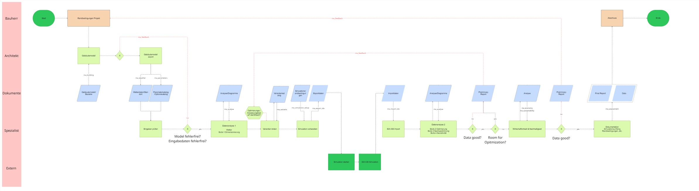

# Review des aktualisierten Workflow-Diagramms

Review-Version: 0.1.1
Stand: 2026-06-18
Quelle: im Codex-Chat neu bereitgestellter Miro-Export
Status: historische Diagrammreferenz; seit 2026-06-21 strukturell durch P007
uebersteuert

## Originalgrafik

## Bezug zum vorherigen Review

Dieses Dokument ergaenzt
`../../archive/workflow/WORKFLOW_DIAGRAM_REVIEW_v0.1.0_2026-06-18.md`. Die
dort beschriebene Gesamtanalyse bleibt fuer alle unveraenderten
Prozessschritte gueltig.

Version 0.1.1 korrigiert vor allem die Modulzuordnung im Bewertungs- und
Berichtsbereich.

## In Version 0.1.1 verbessert

### Economy und Sustainability als eigene Fachmodule

Der Bewertungsbereich verweist jetzt auf `ma_economy` und
`ma_sustainability`. Damit bildet das Diagramm die dokumentierte
Zielarchitektur besser ab:

- `ma_economy` berechnet wirtschaftliche Ergebnisse.
- `ma_sustainability` berechnet Nachhaltigkeits- und Umweltkennwerte.
- Beide Module lagen im damaligen Post-Process; P007 ordnet sie heute Phase 5
  zu.

### Assessment der zusammenfassenden Dokumentation zugeordnet

`ma_assessment` ist im abschliessenden Berichts- und Dokumentationsbereich
angeordnet. Das entspricht seiner geplanten Rolle als uebergeordnete
Bewertungs-, Scoring- und Berichtsschicht.

Die eigentliche Economy- oder Sustainability-Rechenlogik soll nicht in
`ma_assessment` liegen.

## Weiterhin offen

Die folgenden Punkte aus dem Review 0.1.0 sind durch die neue Grafik noch nicht
abschliessend geklaert:

1. Der fachliche Umfang von `Datenanalyse 1`.
2. Die Bedeutung der Analysestufen 1 bis 4.
3. Die konkreten Fragen an den teilweise nur mit `X` bezeichneten
   Entscheidungsknoten.
4. Zweck, Zeitpunkt und Modulzuordnung der Preliminary Reports.
5. Ob Economy und Sustainability parallel oder nacheinander ausgefuehrt
   werden.
6. Die genaue Abgrenzung zwischen Dokumentation, Final Report und
   Projektdatenablage.
7. Welche Prozessschritte fuer die Zeit- und Kostenstudie gemessen oder nur
   geschaetzt werden.

## Architekturabgleich

Die korrigierte Modulzuordnung stimmt mit folgenden aktiven Dokumenten
ueberein:

- `docs/project/architecture/TARGET_ARCHITECTURE.md`
- `docs/project/MASTERARBEIT_LEITFADEN.md`
- `docs/project/decisions/USER_DECISIONS_MASTERTHESIS_CODE.md`

Das Diagramm bleibt trotzdem ein Ist-Entwurf. Verbindlich fuer Modulgrenzen
und Verantwortlichkeiten ist weiterhin `TARGET_ARCHITECTURE.md`.

## Naechster Schritt

Vor einer fachlich neuen Diagrammversion zuerst die weiterhin offenen
Bezeichnungen und Entscheidungsknoten klaeren. Erst danach sollte eine
inhaltlich ueberarbeitete Version 0.2.0 erstellt werden.
