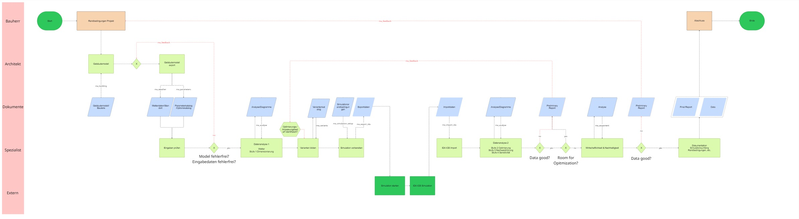

# Review des aktuellen Workflow-Diagramms

Review-Version: 0.1.0
Stand: 2026-06-18
Quelle: im Codex-Chat bereitgestellter Miro-Screenshot
Status: Ist-Entwurf, noch keine verbindliche Zielarchitektur

Hinweis: Die nachfolgende Grafikversion 0.1.1 und ihr Aenderungsreview
korrigieren die Modulzuordnung im Bewertungs- und Berichtsbereich. Die
grundsaetzliche Analyse dieses Reviews bleibt als Ausgangsstand erhalten.

## Originalgrafik



## Zusammenfassung des dargestellten Ablaufs

Das Diagramm beschreibt einen durchgaengigen Planungs- und
Simulationsworkflow mit Rollen- beziehungsweise Informationsbahnen fuer:

- Bauherr
- Architekt
- Dokumente
- Spezialist
- externe Prozesse

Der dargestellte Hauptablauf laesst sich wie folgt zusammenfassen:

1. Projektstart und Festlegung der Randbedingungen.
2. Aufbau und Export des Gebaeudemodells.
3. Bereitstellung von Gebaeude-, Wetter- und Parameterdaten.
4. Pruefung von Modell und Eingabedaten.
5. Erste Datenanalyse beziehungsweise Dimensionierungsstufe.
6. Variantenbildung.
7. Vorbereitung der Simulation und Exportdaten.
8. Externe IDA-ICE-Simulation.
9. Import der IDA-ICE-Ergebnisse.
10. Zweite Datenanalyse mit Optimierung, Variantenvergleich und Sensitivitaet.
11. Pruefung von Datenqualitaet und weiterem Optimierungsbedarf.
12. Wirtschaftlichkeits- und Nachhaltigkeitsbewertung.
13. Abschließende Datenpruefung, Dokumentation, Final Report und Datenablage.
14. Abschluss und Ende.

Mehrere Rueckkopplungsschleifen fuehren bei fehlerhaften Daten oder
Optimierungsbedarf ueber `ma_feedback` in fruehere Prozessschritte zurueck.

## Gut geloest

### Rollen und Informationsarten

Die Swimlanes machen sichtbar, dass nicht jeder Schritt von derselben Rolle
ausgefuehrt wird. Das ist fuer die geplante Zeit- und Personalkostenanalyse
besonders wertvoll. Bauherr, Architekt, Spezialist, Dokumente und externe
Prozesse koennen spaeter getrennte Zeit- und Kostensaetze erhalten.

### Trennung von Prozess und Dokumenten

Dokumente wie Gebaeudemodell, Wetterdaten, Parameterkatalog,
Variantenkatalog, Importdaten, Analyseergebnisse und Reports werden als eigene
Informationsobjekte dargestellt. Diese Trennung passt zur modularen
Datenstruktur des Projekts.

### Externe IDA-ICE-Simulation

Die Simulation ist als externer Schritt zwischen Vorbereitung und Import
dargestellt. Das entspricht der aktuellen Zielarchitektur:

```text
ma_simulation_setup
ma_export_ida
IDA ICE
ma_import_ida
```

### Iterative Rueckkopplung

Die Rueckspruenge bei fehlerhaften Eingaben, unzureichenden Daten oder weiterem
Optimierungsbedarf passen zur geplanten Rolle von `ma_feedback`.

### Mehrstufige Analyse

Das Diagramm unterscheidet eine fruehe Analyse fuer Randbedingungen und
Dimensionierung von einer spaeteren Analyse der Simulationsergebnisse. Diese
fachliche Trennung ist sinnvoll, muss jedoch bei den Modulbezeichnungen noch
praezisiert werden.

## Unklar oder anzupassen

### Datenanalyse 1 ist nicht eindeutig ma_analyse

Die erste Datenanalyse umfasst Wetter, Dimensionierung und gegebenenfalls
Eingabepruefungen. Diese Aufgaben gehoeren nicht vollstaendig zu
`ma_analyse`.

Empfohlene Zuordnung:

- Wetteranalyse: `ma_weather`
- Gebaeude- und Zonendaten: `ma_building`
- Parameterpruefung: `ma_parameters`
- erste technische Dimensionierung: als eigener fachlicher Teil oder spaeter
  genauer zuordnen

Die Bezeichnung `Datenanalyse 1` kann im Diagramm bestehen bleiben, sollte aber
nicht pauschal mit dem Modul `ma_analyse` beschriftet werden.

### Gebäudemodellexport und IDA-Export unterscheiden

Der fruehe `Gebaeudemodellexport` scheint ein Architektur- oder
Referenzmodell-Export zu sein. Der spaetere Export vor der IDA-Simulation ist
der eigentliche Variantenexport aus `ma_export_ida`.

Empfehlung:

- frueh: `Gebaeudemodell bereitstellen`
- spaeter: `IDA-Variantenexport vorbereiten`

Damit werden zwei fachlich unterschiedliche Exporte nicht verwechselt.

### Unbenannte Entscheidungsknoten

Mehrere Rauten enthalten nur ein `X`. Dadurch ist nicht eindeutig, welche
Frage dort entschieden wird.

Jede Raute sollte eine konkrete Frage erhalten, zum Beispiel:

- `Gebaeudemodell vollstaendig?`
- `Eingabedaten plausibel?`
- `Simulationsergebnisse vollstaendig und plausibel?`
- `Weiterer Optimierungsbedarf?`
- `Bewertungsdaten vollstaendig?`

Die ausgehenden Kanten sollten eindeutig mit `Ja` und `Nein` gekennzeichnet
werden.

### Doppelte Bezeichnung Data good?

Im Diagramm gibt es mehrere Datenpruefungen mit derselben oder sehr aehnlicher
Bezeichnung. Sie pruefen vermutlich unterschiedliche Datenstaende.

Empfehlung:

- nach IDA-Import: `Simulationsergebnisse vollstaendig und plausibel?`
- nach Economy/Sustainability: `Bewertungsdaten und Annahmen vollstaendig?`

### Wirtschaftlichkeit und Nachhaltigkeit trennen

Der gemeinsame Prozesskasten `Wirtschaftlichkeit & Nachhaltigkeit` passt nicht
mehr vollstaendig zur aktuellen Modulentscheidung.

Zielstruktur:

```text
ma_economy
ma_sustainability
ma_assessment
```

Im Diagramm koennen Economy und Sustainability parallel oder nacheinander
dargestellt werden. Danach fuehrt `ma_assessment` die Ergebnisse zu Bewertung,
Factsheets und Berichten zusammen.

### ma_assessment fehlt als eigener Schritt

Die Preliminary Reports und der Final Report deuten bereits auf eine
uebergeordnete Bewertungs- und Berichtsschicht hin. Diese Rolle sollte im
Diagramm explizit `ma_assessment` zugeordnet werden.

### Preliminary Report fachlich praezisieren

Es ist noch unklar, ob Preliminary Reports:

- reine technische Analyseberichte,
- Pruefberichte bei fehlerhaften Daten,
- Zwischenbewertungen oder
- Entscheidungsvorlagen

darstellen. Die Dokumenttypen sollten entsprechend benannt und einem Modul
zugeordnet werden.

### Dokumentation und Final Report abgrenzen

Der grüne Prozess `Dokumentation` und die Dokumente `Final Report` sowie `Data`
sind sinnvoll, ihre Verantwortung ist aber noch offen.

Moegliche Zuordnung:

- technische Simulationsdokumentation: `ma_analyse`
- wirtschaftliche und oekologische Teilergebnisse: `ma_economy` und
  `ma_sustainability`
- zusammenfassender Final Report und Factsheets: `ma_assessment`
- Projektdatenablage: modulare Datenstruktur des Projekts

## Bedeutung fuer die Zeit- und Kostenanalyse

Das Diagramm eignet sich als Grundlage fuer die Untersuchung des manuellen und
automatisierten Prozessaufwands.

Jeder Prozessschritt sollte spaeter um folgende Messpunkte ergaenzt werden:

- verantwortliche Rolle
- notwendiger Wissensstand
- aktive Arbeitszeit
- Maschinenlaufzeit
- Wartezeit
- Fehler- und Korrekturaufwand
- Wiederholungsanzahl
- Automatisierungsgrad

Die Dokumentenbahn kann zusaetzlich zeigen, welche Informationen manuell
erstellt, automatisch erzeugt oder nur geprueft werden.

## Empfohlene fachliche Zielreihenfolge

```text
Pre-Process
  Randbedingungen Projekt
  ma_building
  ma_parameters
  ma_weather
  Eingaben pruefen
  fruehe Dimensionierung
  ma_variants
  ma_simulation_setup
  ma_export_ida

Simulation
  IDA ICE

Post-Process
  ma_import_ida
  ma_analyse
  Optimierungsentscheidung
  ma_economy
  ma_sustainability
  ma_assessment

Feedback
  ma_feedback

Abschluss
  Dokumentation
  Final Report
  Datenablage
```

## Offene Fragen

1. Was umfasst `Datenanalyse 1` fachlich genau?
2. Welche Analysestufen sind mit Stufe 1 bis Stufe 4 gemeint?
3. Welche Entscheidung wird an jedem aktuell unbenannten `X` getroffen?
4. Wann wird ein Preliminary Report erzeugt und welchem Zweck dient er?
5. Laufen Economy und Sustainability parallel oder nacheinander?
6. Ist `Dokumentation` ein manueller Arbeitsschritt, eine Softwarefunktion oder
   beides?
7. Welche Schritte sollen fuer die Zeitstudie tatsaechlich gemessen und welche
   nur geschaetzt werden?

## Naechster Schritt

Die Originalgrafik ist unveraendert als
`WORKFLOW_DIAGRAM_v0.1.0_2026-06-18.jpg` abgelegt. Als naechstes die offenen
Bezeichnungen direkt mit dem Nutzer klaeren und erst anschließend eine
ueberarbeitete Version 0.2.0 erstellen.
